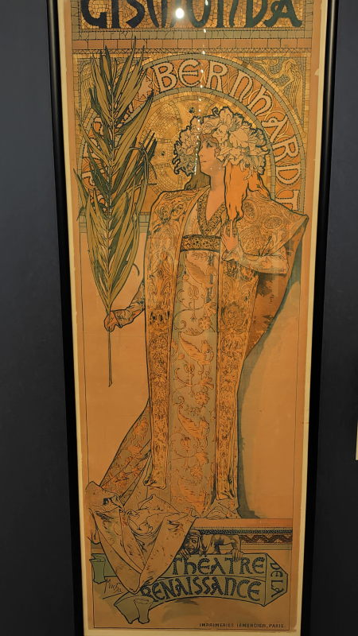
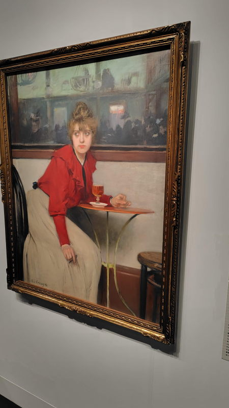
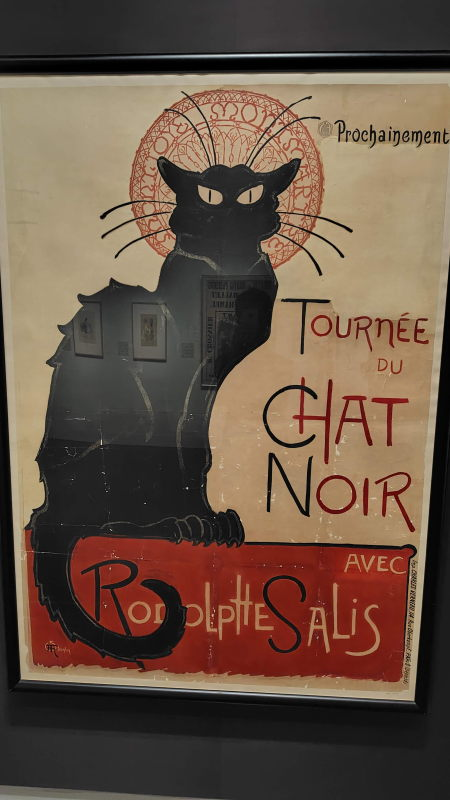
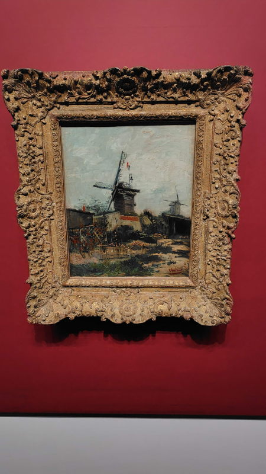

---
tags:
    - tokyo
---
# 三菱一号館美術館
東京駅から少し南西に歩いたところにある。
おしゃれというか古い洋館のような佇まいの美術館。

## カフェに集う芸術家 印象派からゴッホ、ロートレック、ピカソまで
<https://mimt.jp/ex_sp/cafe/>

2026-07-10 訪問。

平日というのもあってか人も少なめでゆったり見ることができた。
撮影も可能。ミュシャの作品がひとつ（ジスモンダ）だけあって、
生で見るのは初めてだったのだが、花と女性というのは良いなと思う。

ミュシャ

購入したポストカード

- ラモン・カザス マドレーヌ

- オーギュスト・ルノワール パリ、トリニテ広場

- テオフィル・アレクサンドル・スタンラン シャ・ノワール（黒猫）巡業公演

これはゴッホだったかな。タイトルを覚えていないけど。

## リンク
- <https://mimt.jp/>
