---
tags:
    - tianjin
---
# 馍界传奇
Mó jiè chuánqí

饅頭界の伝説といった意味。
陝西省名物の中国風ハンバーガー（肉夹馍 Ròu jiā mó）とビャンビャン麺の店。

テーブルにQRコードがあってWeChatで読み込んで注文する。
パクチーを無しにするオプションがある。

## 招牌BIANG BIANG面 Zhāo pái biáng biáng miàn
ビャンビャン麺。𰻝𰻝面。

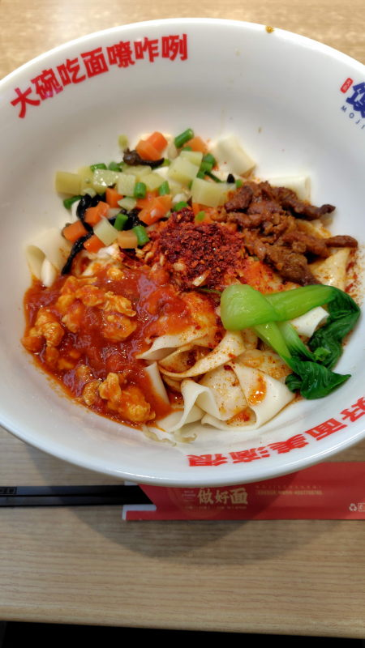

## 潼关肉夹馍 Tóngguān ròu jiā mó
12元。中国風ハンバーガー

## 小酥肉浆水面 Xiǎo sū ròu jiāng shuǐmiàn
17.8元。揚げた（豚）肉とネギ?が入ったラーメン。

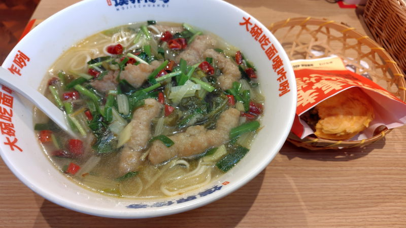

## 特色鸡肉馍 Tèsè jīròu mó
11元。

## 鲜肉小馄饨 Xiān ròu xiǎo húntún
ワンタンスープ。

## 街边锅巴土豆 jiē biān guōbā tǔdòu
ワンタンとセットで18.8元。唐辛子が少し入った辛めのタレが掛かっている。

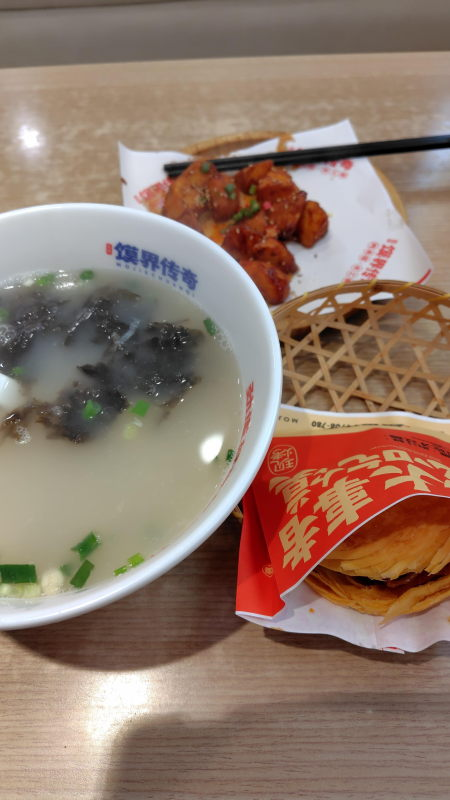

## 番茄牛肉面 Fānqié niúròu miàn
25元。トマトベースのスープにトマトと角切りの牛肉が入っている

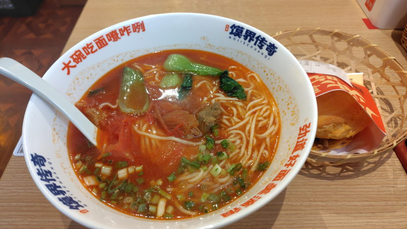

## 长安新派炸豆腐 Cháng'ān xīnpài zhà dòufu
12元。辛めの餡が掛かった揚げ豆腐

## 传奇羊肉泡馍 Chuánqí yángròu pào mó
30元

細かくちぎられたパンというか牛脂みたいのが入っている。
添えられているのはニンニク。

[蘭州](./tianjin-lanzhouniuroumian.md)の泡馍のほうが美味しい。

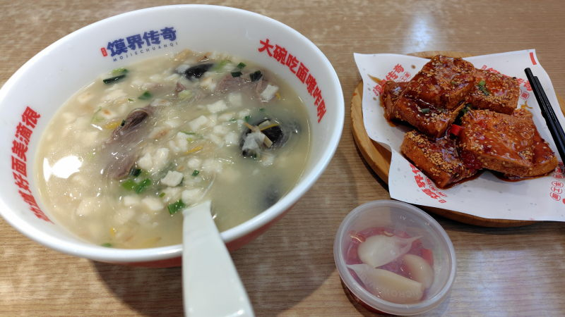

## 岐山臊子面 Qíshān sàozǐ miàn
18元。辛いが、見た目ほどではない。ラー油につけてるかのような油っこさ。

臊子はミートソースのこと。

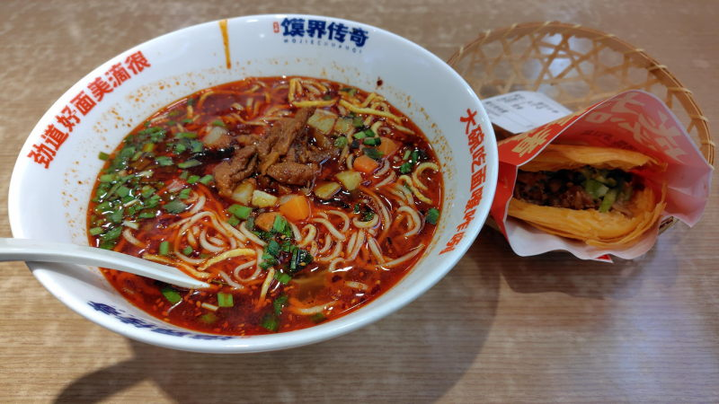

## 老鸭粉丝汤 Lǎo yā fěnsī tāng
15.8元。肉とは言い難い、成形されたゼラチンみたいのが入っている。鴨の血を固めたやつかもしれない。

肉というか贓物系も入ってる。1匹まるごと使いましたという感じ。不味い。

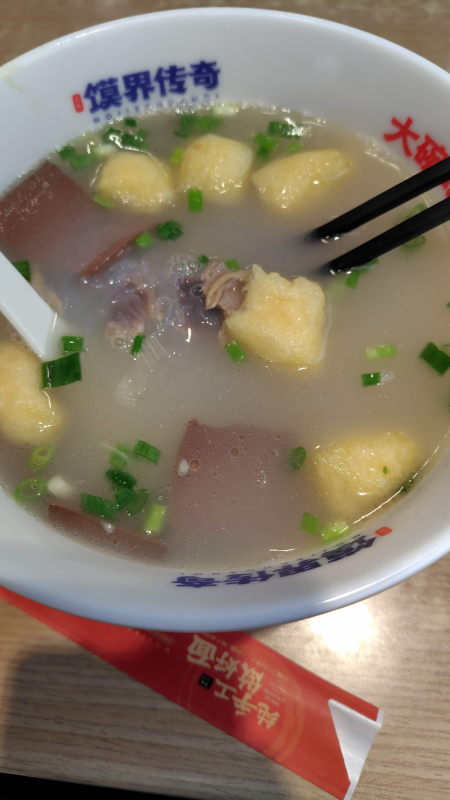

## 大刀卤肉面 Dàdāo lǔ ròu miàn
25.8元。ルーロー面、普通のラーメンに比較的近いかもしれない。醤油ラーメンのような感じ。

## 深海鳕鱼条 Shēnhǎi xuěyú tiáo
16.8元。魚フライ。骨もなくて食べやすい。

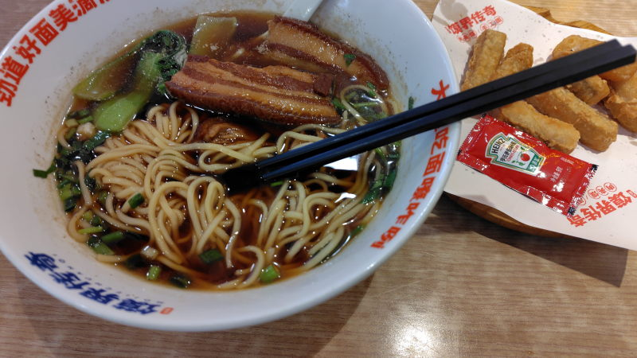

## 炸香肠 Zhà xiāngcháng
5元。ソーセージ

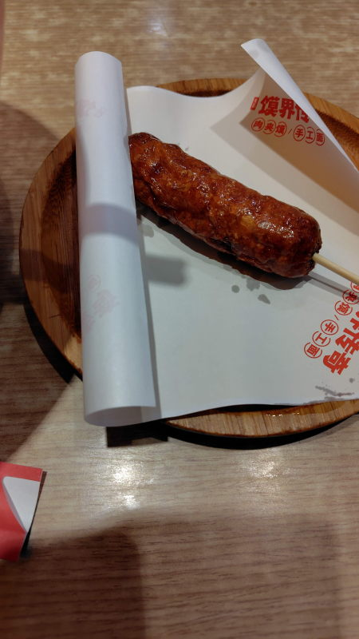

## 大碗油泼面 Dà wǎn yóu pō miàn
16元。陝西省名物、ビャンビャン麺の廉価版

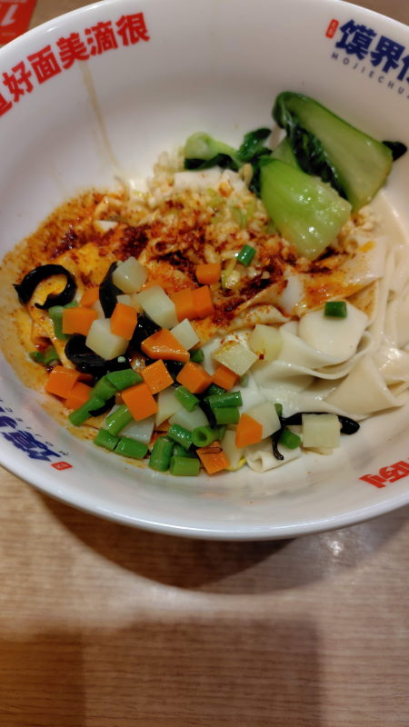

## 鸡骨浓汤酸辣粉
18元。辛い!線豆腐とエリンギと粉麺。ラー油のそのものみたいなスープ

## 美味海藻丝
わかめサラダ

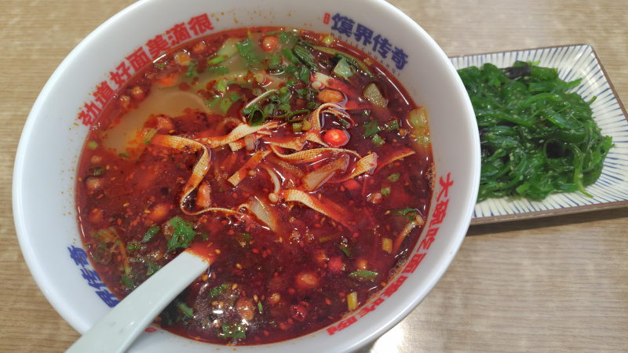

## 新疆番茄土豆粉
21.9元。でんぷん麺はうどんみたいな麺。豆腐丝、うずらの卵が2つ。
トマトの味が強めであっさりしている。

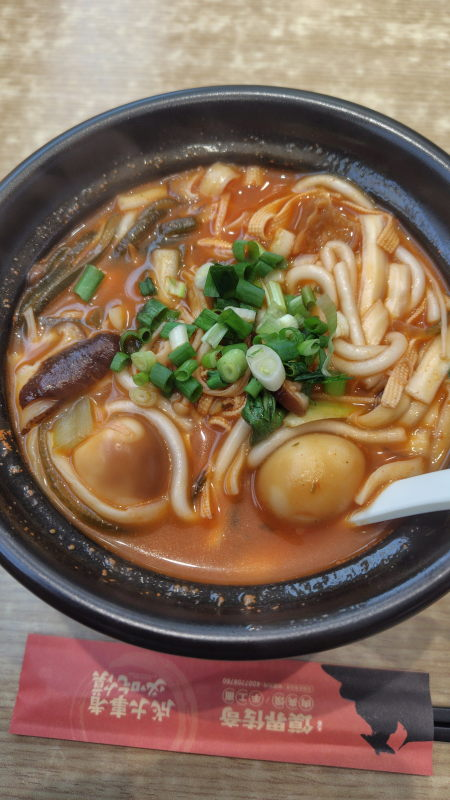

## 西北大盘鸡拌面
28元。骨付き鶏肉、トマト、ピーマン、刀削面、新疆料理。

## 爽口拌木耳
8元。きくらげサラダ

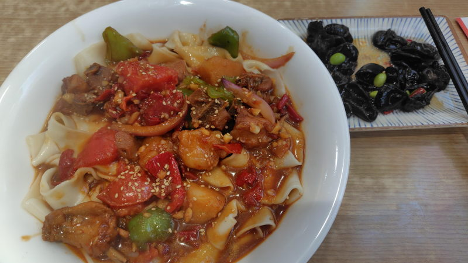

## 裹酱爆汁炸鸡
11.8元。ソースを絡めた揚げ鶏。チョコボールみたいな味がする。

## 养胃三鲜土豆粉
19.9元。名前のとおりあっさりしている。

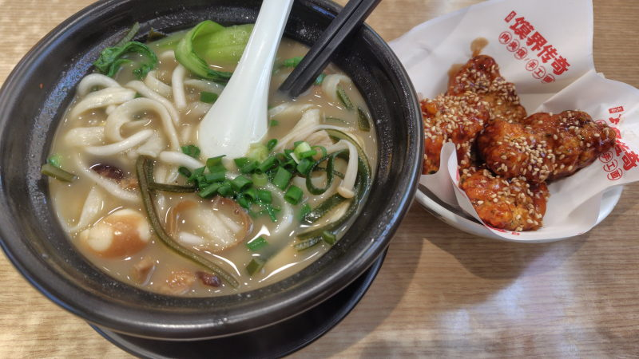