---
tags:
    - hiking
date: 2025-08-23
---
# 扇山登山 5回目
酷暑、蜘蛛の巣だらけ。

いつもどおりの電車に乗って07:00ごろに鳥沢駅に到着。
何人か降りた人はいて多分同じ山に登るのだろうが結局登山道では誰ともすれ違うことはなかった。

まあ暑いし、わざわざこの山に登る物好きもいないのだろう。

## 山行記録
駅から梨の木平までの道中で見つけた花々。

百合

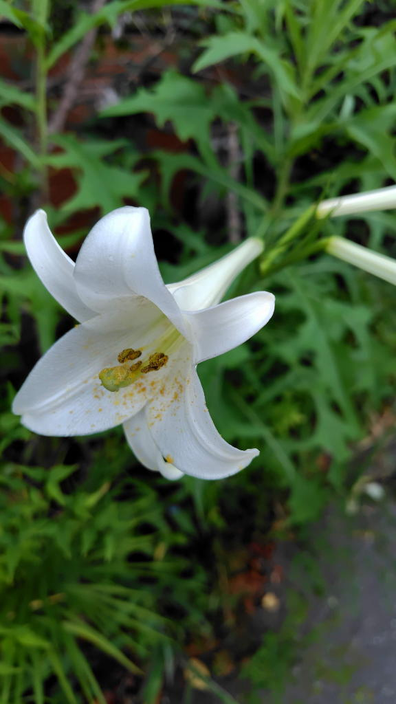

フジカンゾウ

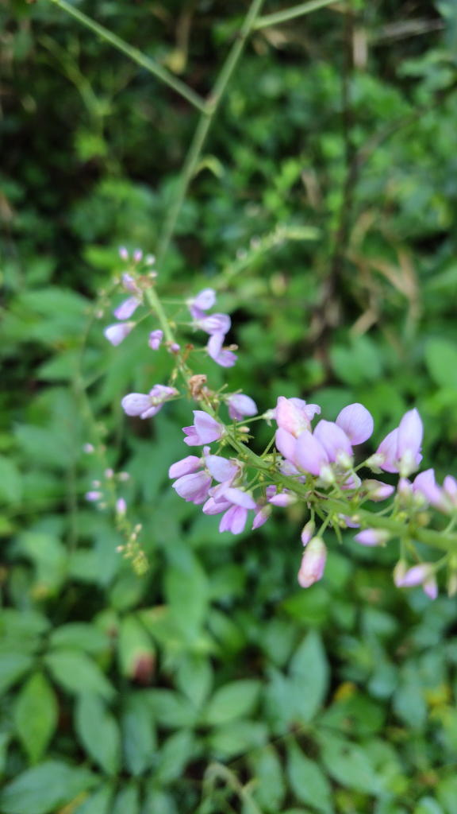

ツユクサ

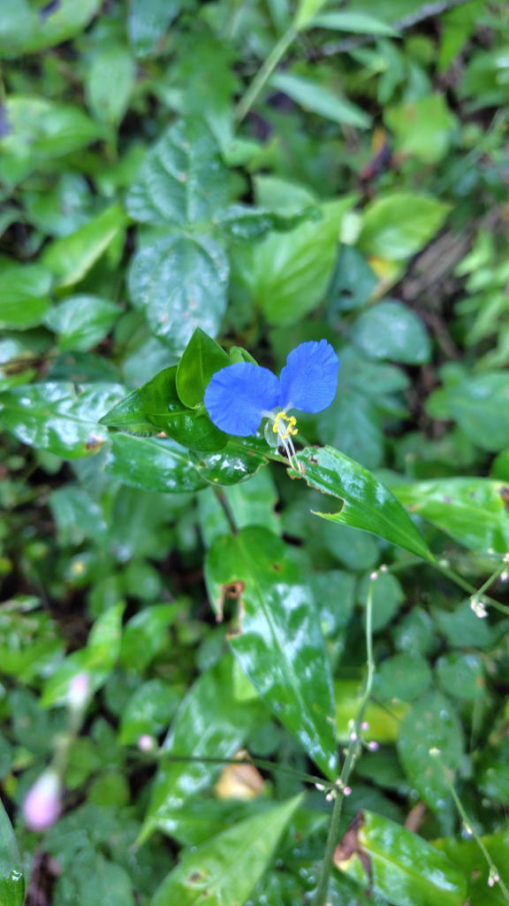

ツリガネニンジン

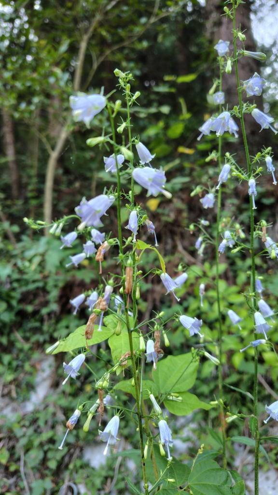

ヤブラン

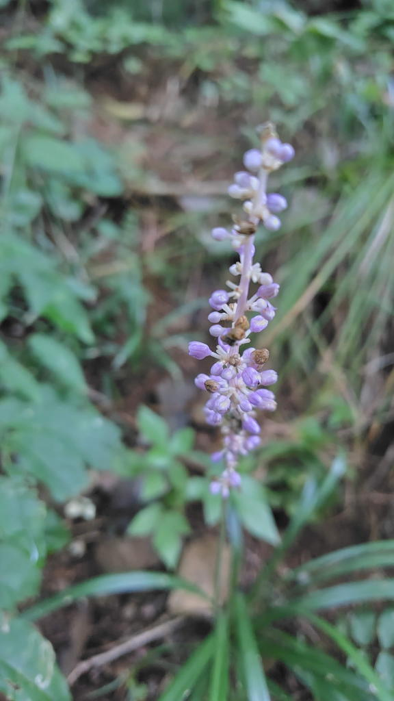

紫陽花

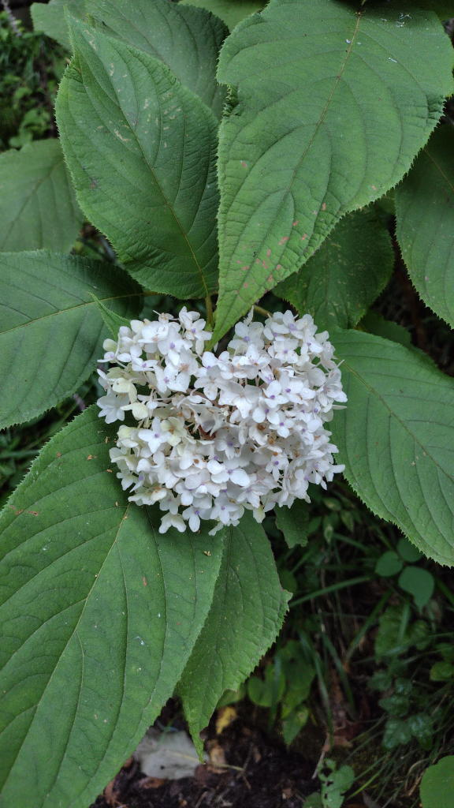

途中に富士山が見えるスポットがある。

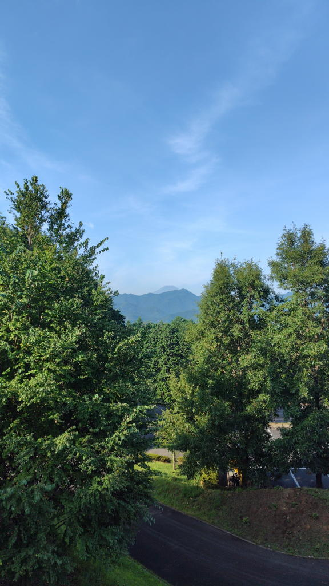

三つ峠かな。

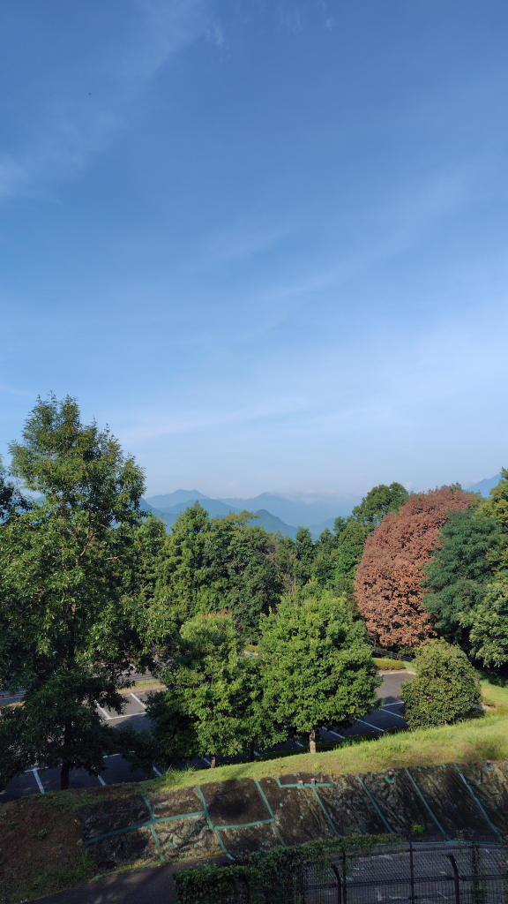

1時間位歩いて梨の木平登山口に到着。ずっとブンブン言う虫につきまとわれていて
虫よけを買おうと決意する。
ただ、酷暑とはいえ割と涼しい風が吹いているところもあったりした。

途中にある湧き水を触ってみると本当に冷たくて手と顔に塗りたくって身体を冷やすことができた。
飲めるのだろうか?

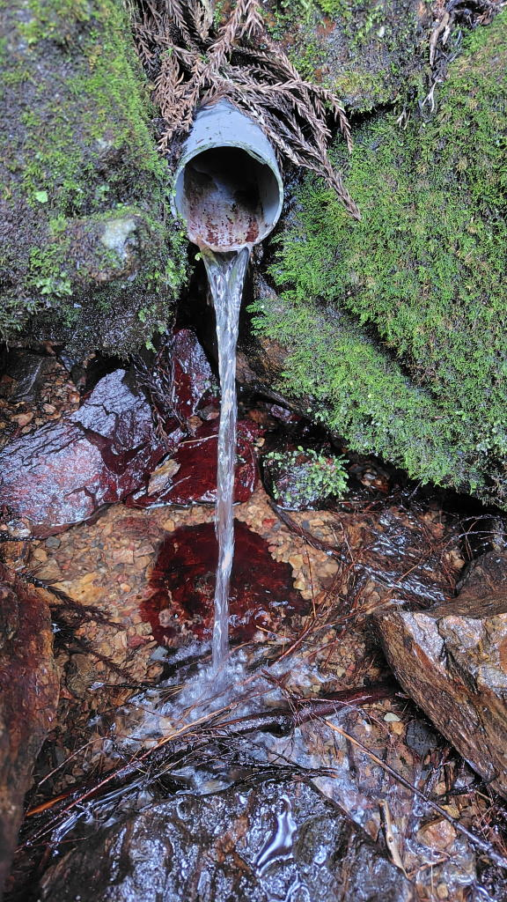

09:20ごろに登頂。たいてい誰かしら山頂にいるものだが、今回は大量のトンボが飛び交っているだけだった。

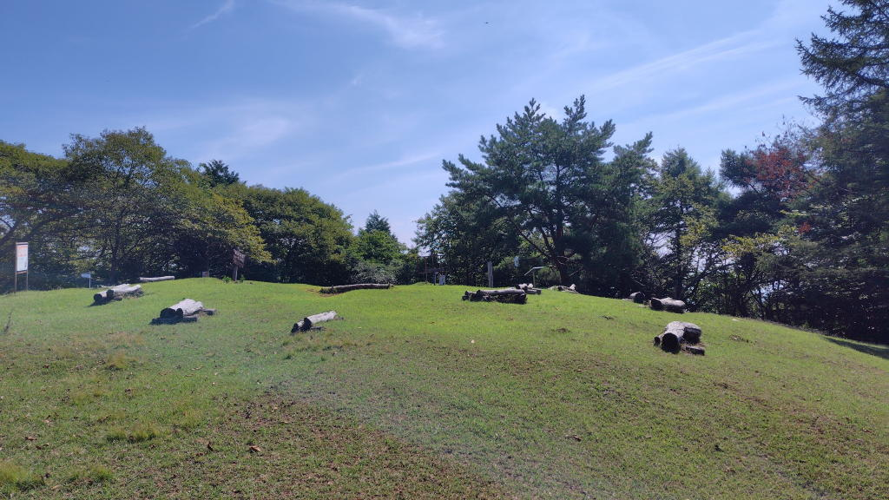

富士山は雲をかぶってしまって見えず...看板が折れていた。

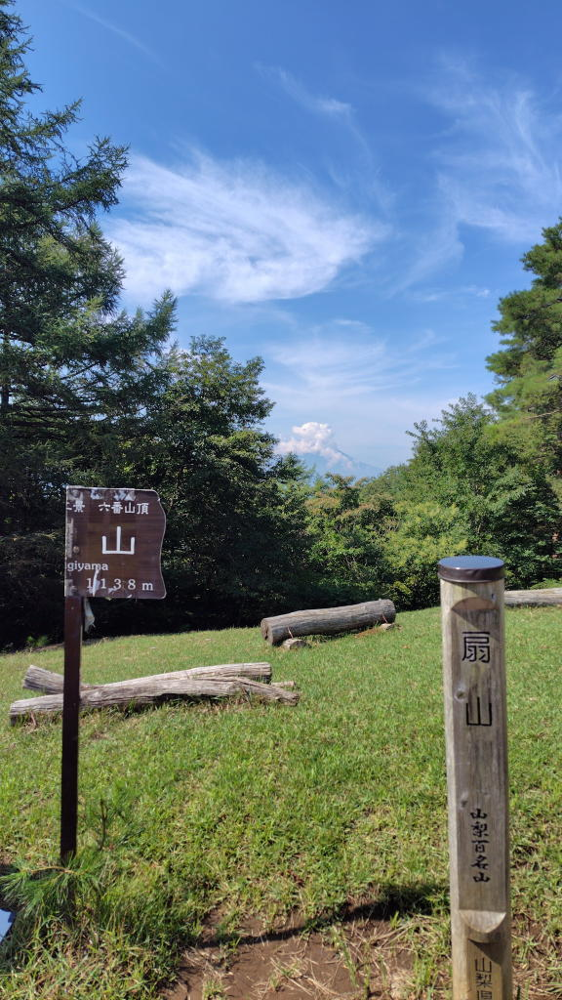

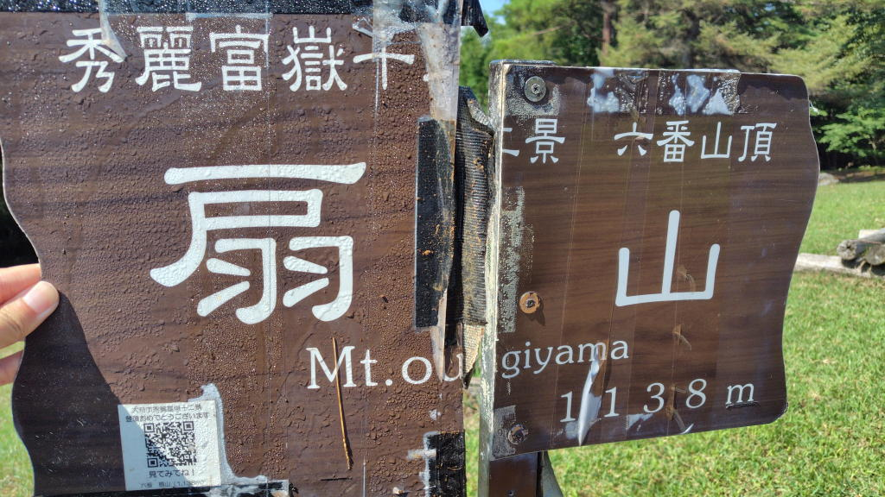

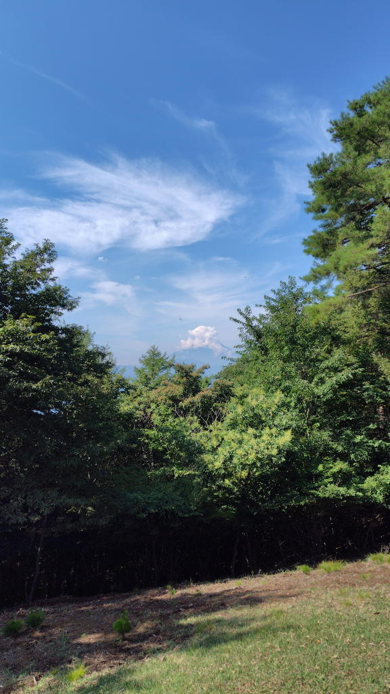

しばらく休憩していつもどおりエコの里側から下山したのだが、
登山道にまで蜘蛛の巣が張り巡らされている状態だった。
やっぱりこの時期に登る人が誰もいないんだろう。
真夏は高山か東北方面か、あるいは登山をしない普通の旅行をしたって良いんじゃないだろうか。

山頂近くにマルバダケブキ

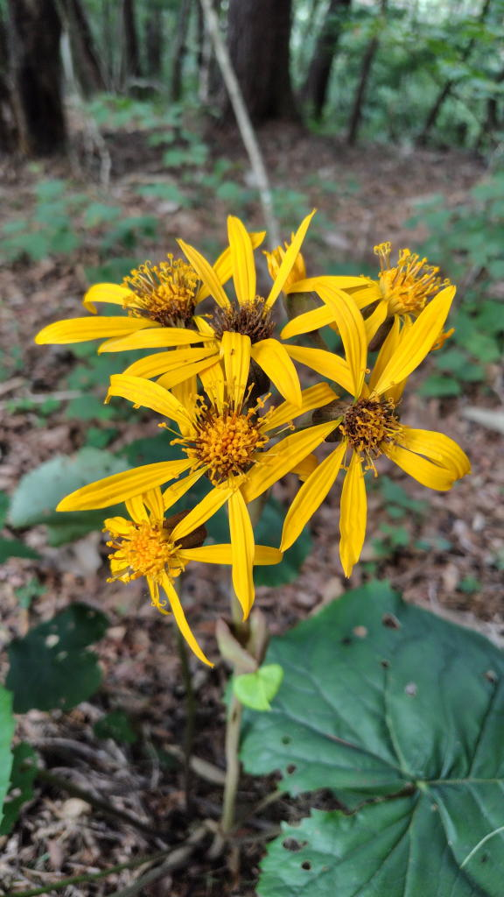

降りたあと、エコの里にムクゲ

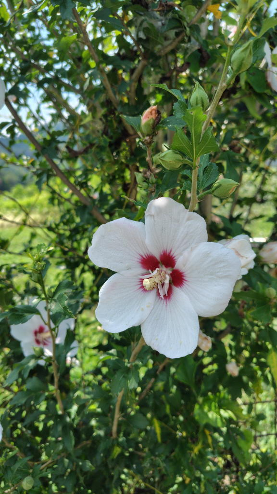

扇山を望む、どれか分からないけど。

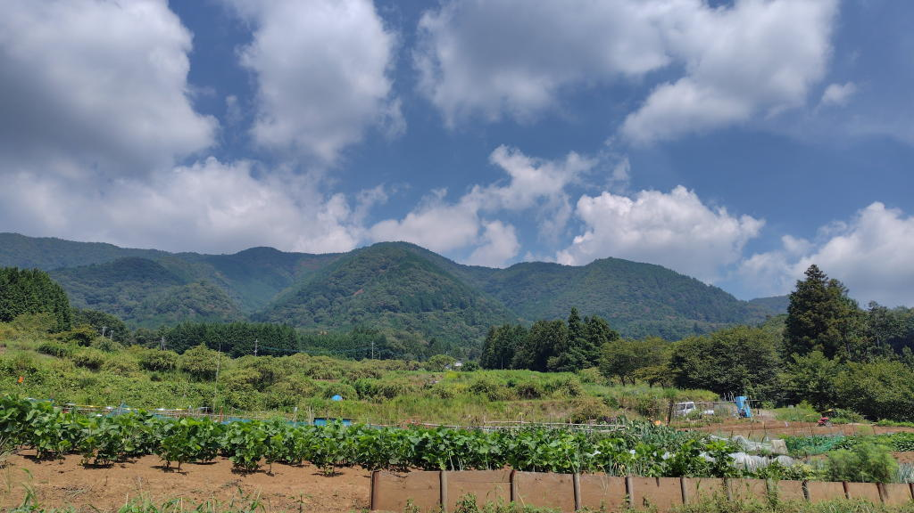

この時期は花が色々咲いているからそういう楽しみはあるかもしれない。
花の名前は家に帰ってから本やGoogle Lensで調べた。

## リンク
- <https://yamap.com/activities/42377238>
- <https://misskey.io/notes/abrh0420tagi09wm>
