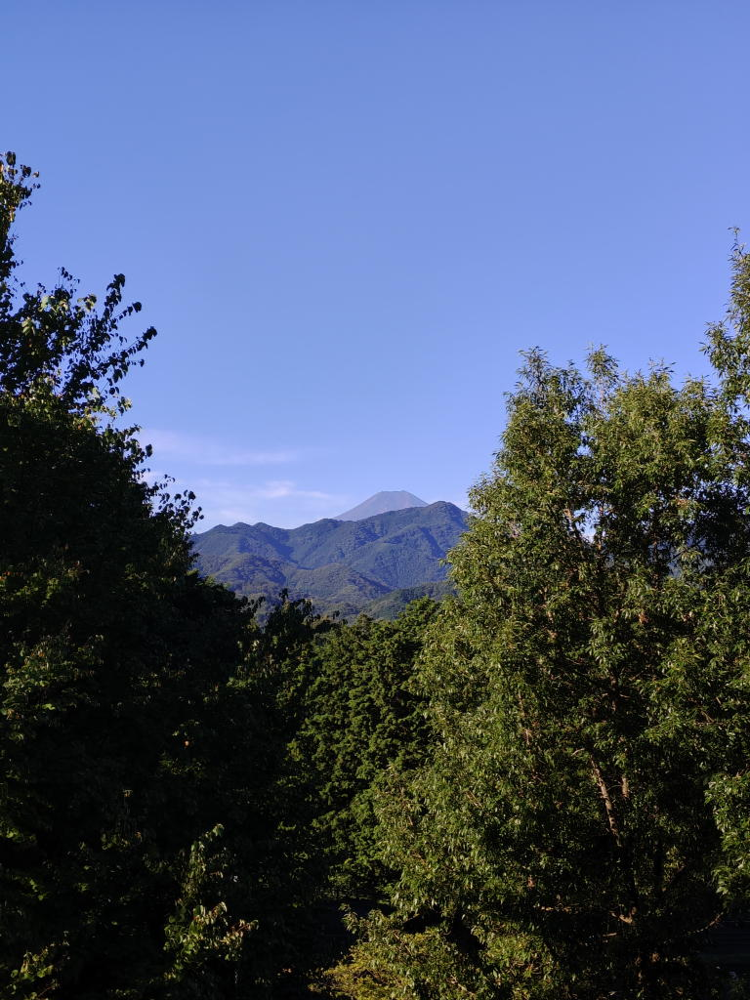
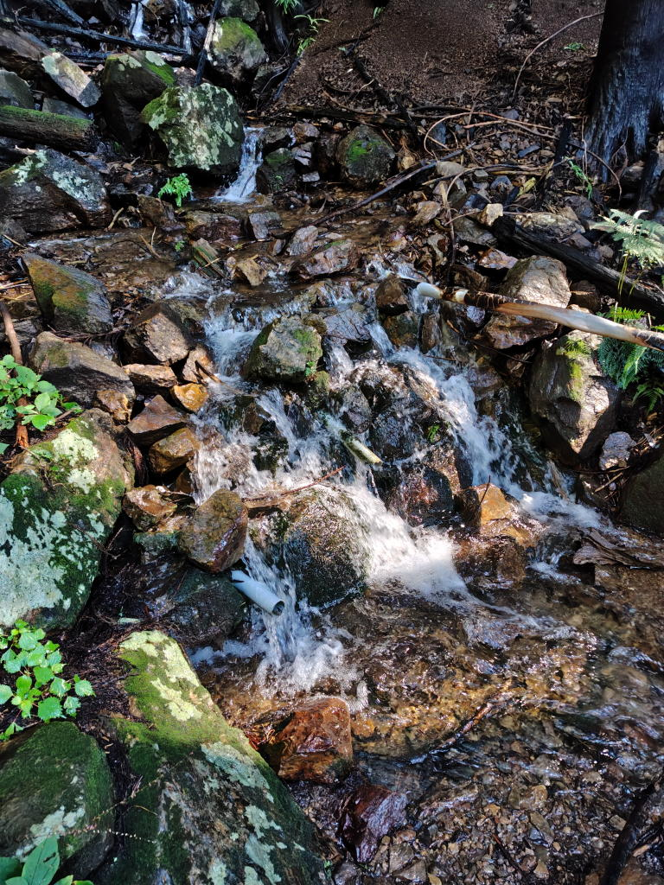
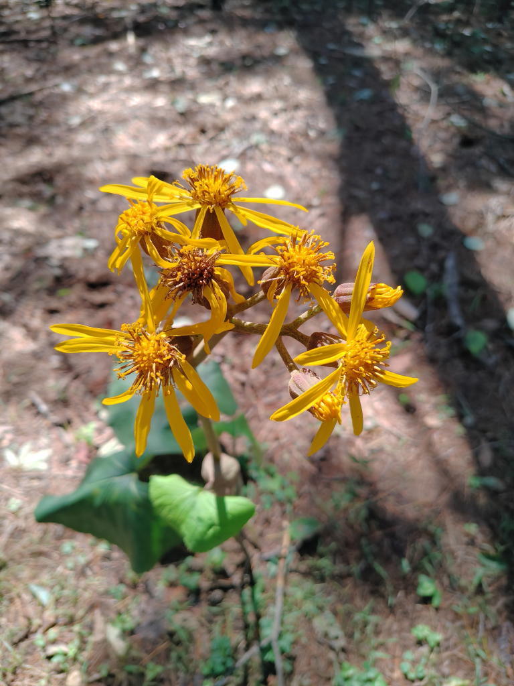
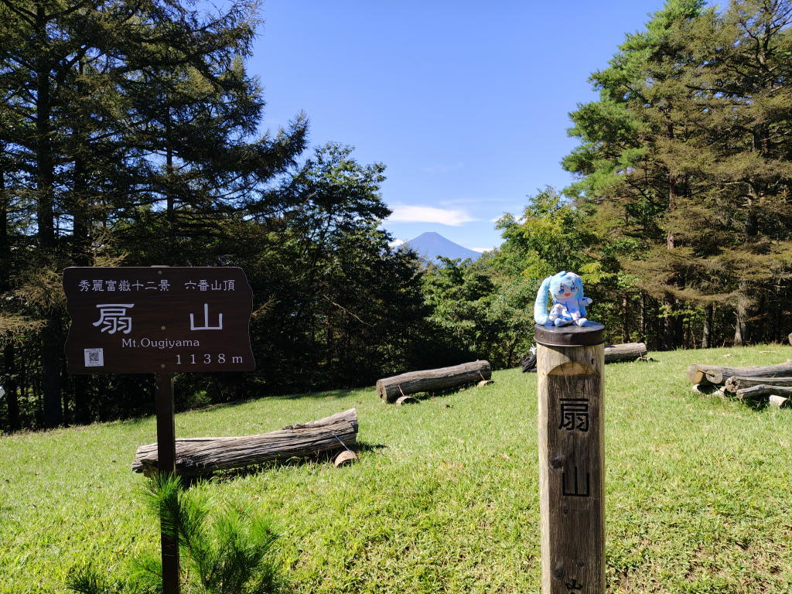
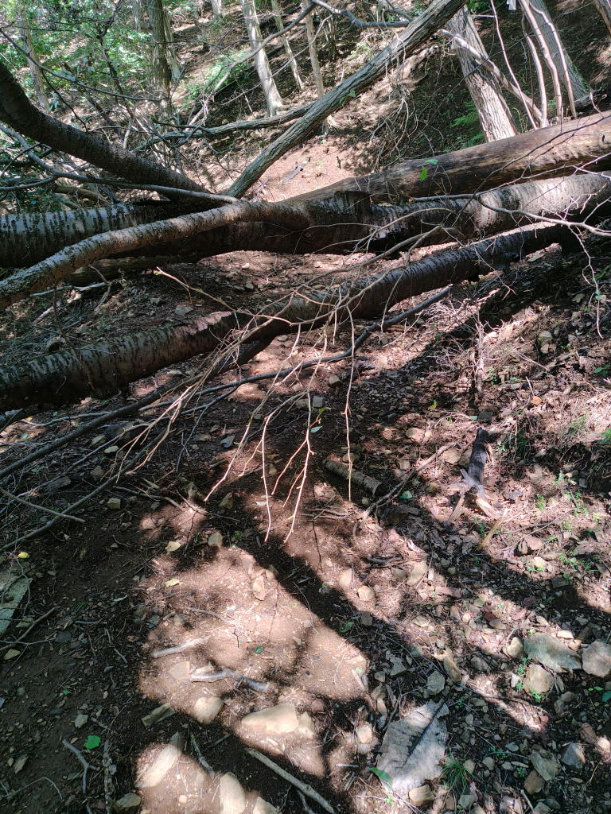
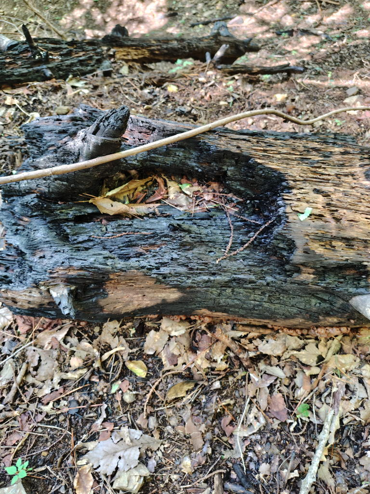
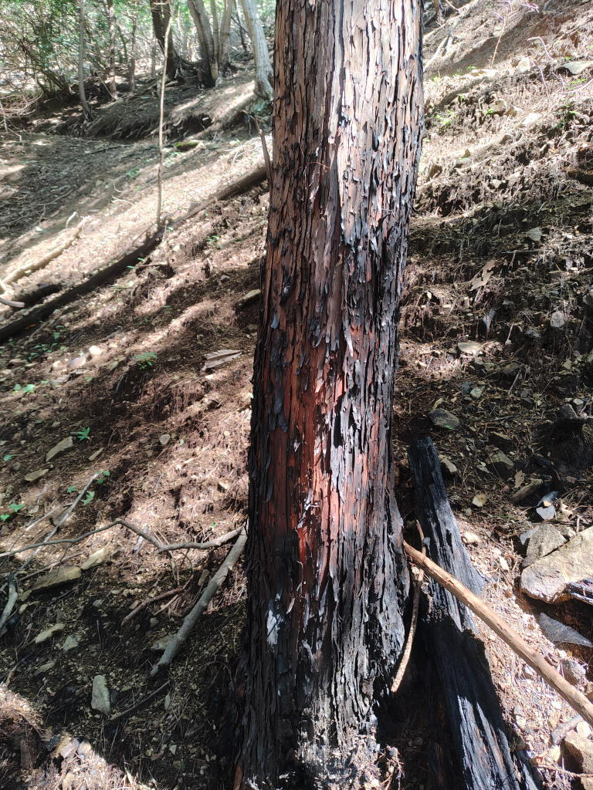
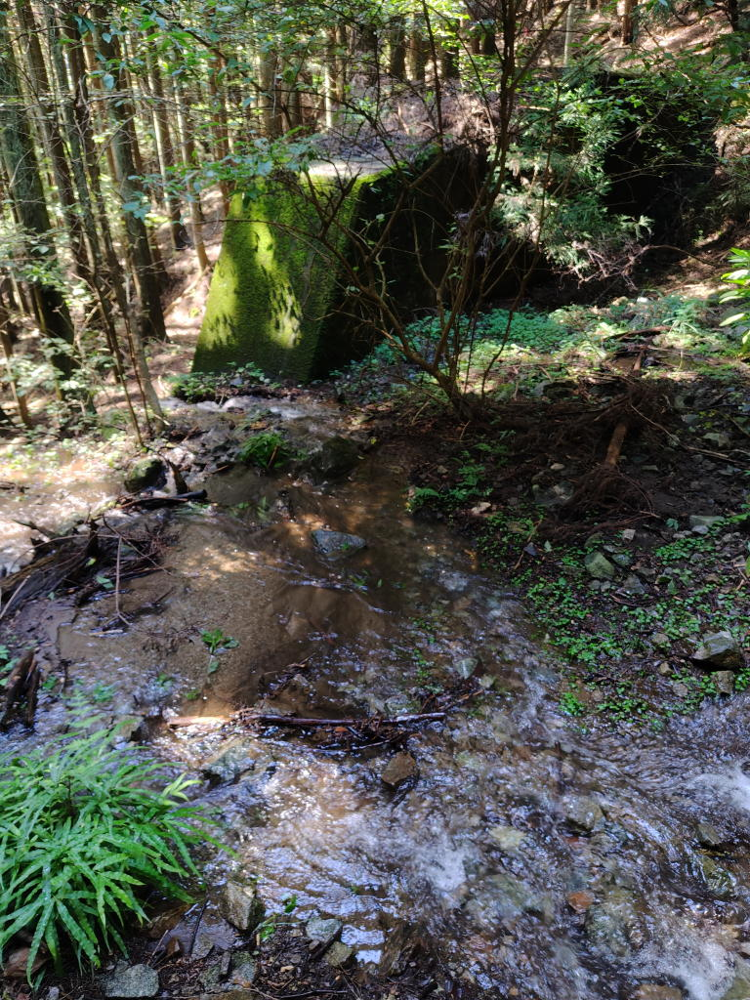
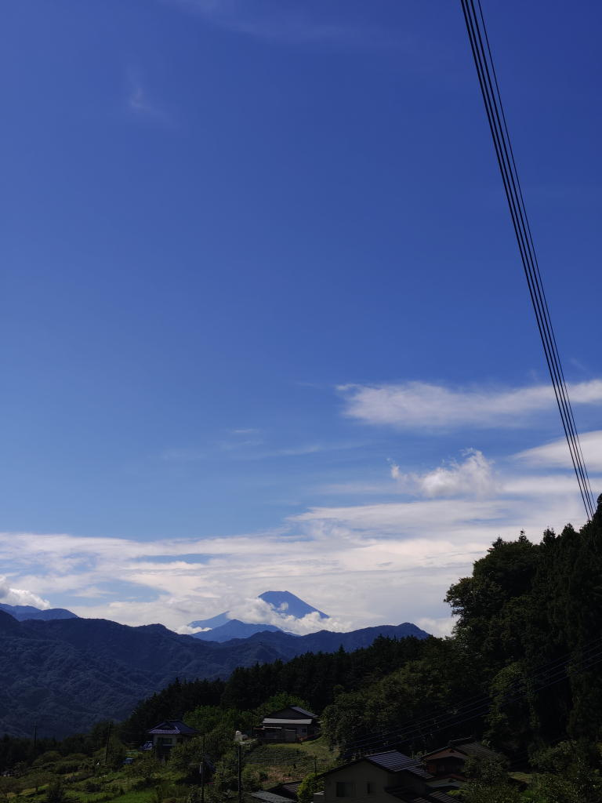
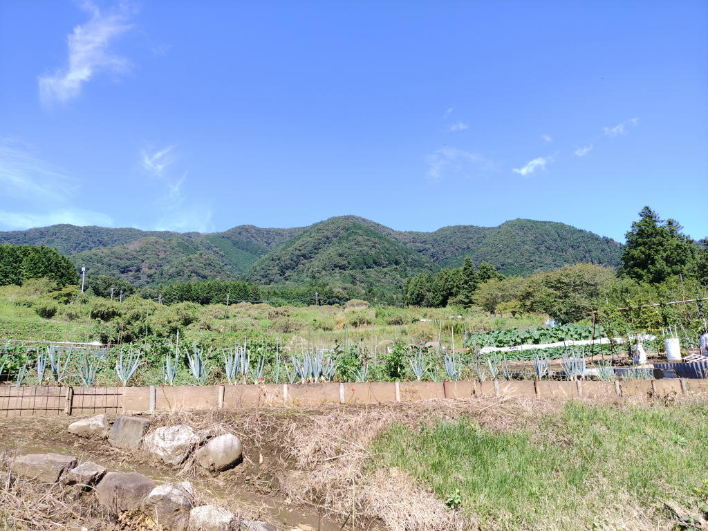

---
tags:
    - hiking
date: 2026-09-14
---
# 扇山登山 7回目
火事になってから初めての登山。[扇山](./ougiyama.md)は今回で7回目になる。

中国研修をしていた半年間で体力が衰えていたが、
何度か高尾山を登ったりジョギングをしたりして
そろそろ大丈夫だろうというので登ってみることにした。

## 山行記録
07:00ごろに鳥沢駅に到着。
食パンを一枚食べて登山靴に履き替えて出発。

ザックを背負っての登山は久々で結構重たく感じた。
鍛錬という意味では高尾山を登るときにもザックで登ったほうが良いかもしれないな。

久しぶりに富士山を見た。雪はまだかぶっていなかった。

舗装路をひたすら歩いて08:00ごろに梨の木平に到着。ここまでは火事の影響もなさそうな感じでいつもどおりだった。

ここから先が登山道になるのだが、いつもよりもザレている印象が強かった。
焼けて根元の方が黒くなった木や炭みたいになった木片があちこちに転がっていた。

08:40、水場に到着。ここのところ続いていた雨の影響が今までにないくらい水量が多くて、
下流の道も川みたいになっていた。通れそうな場所を見つけてなんとか登ることはできた。
画像じゃ伝わらないだろうが...

09:00、ツツジコースとの分岐に到着。ちょうど先行していた方が休んでいて
久しぶりに富士山が見えますねと声をかけられた。

私も少し休んでから再出発。
枯れかけたマルバタケブキ?だろうか。

09:40ごろ、山頂に着いた。1人先客がいたが、
あまり気にせずにミクちゃんを扇山の看板の上に乗せて写真を撮る。
これも今回の目的の一つなのだ。

日差しが照りつけてとにかく暑かった。
熱中症になりそうだなと思いながら、塩タブレットを何個も食べて
日陰を見つけてしばらく休む。

10:00ごろに下山開始。火災後の状態がよくわからないから、
元の道をピストンすべきかなとも思ったが、東側の道を通って
エコの里経由で降りることにした。

つづら折りの箇所で倒木が何本かあって通りにくかった。
迂回したりくぐったりすることはできるから大きな問題にはならないが。

道が完全に塞がっていた。

黒焦げになった木。

下山途中に結構大規模な治山工事というのをやっていて
今まで水が通っていなかった道が川みたいになっていた。

11:15、舗装路に出る。

少し雲をかぶってきている。

扇山方面を撮る。どれが扇山かよくわからないけど...

11:50ごろ、鳥沢駅に戻る。

11:58、高尾行きの電車に乗る。
マダニみたいのが腕を歩いているのに気づいて追い払った。
吸血はされていないみたいで良かった。というか、マダニを初めて見た。

## リンク
- <https://yamap.com/activities/51101237>
- <https://misskey.io/notes/ar48h00v6a5b06a1>
