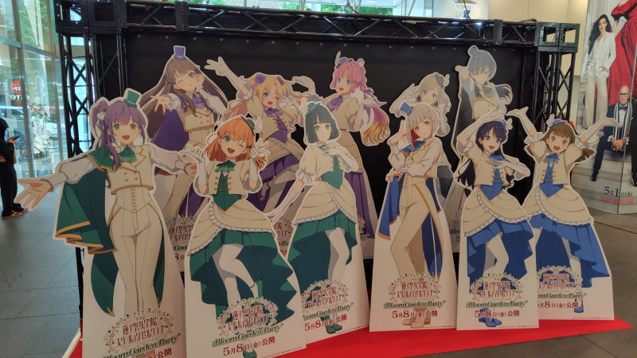

---
tags:
    - movie
---
# パリに咲くエトワール
## きっかけ
中国の春節の際に一時帰国していたのだが、
最寄りの映画館でポスターを貼ってあるのを見かけた。
3/13封切りでそのとき見ることはできなかったが、見るからに私の好みのような感じで興味を持った。

その後、4月末頃の帰省を前に改めて上映劇場を調べていたのだが、
その映画館ではすでに上映が終わってしまっていた。
なかば諦めかけていたのだが、新宿ピカデリーで上映していることが判明。
時間的にも問題なく行けそうという幸運に恵まれる。

## 感想
冒頭のステージでバレエを真似て踊る千鶴とフジコのかけ合いでもうすっかり引き込まれてしまっていた。その時見た千鶴を忘れられないで絵に描いて残しているところも、パリという異国の地で再会して夢の後押しをしてあげるフジコも、そんなフジコと過ごす中で自分のやりたいことを思うままにやろうと変わっていく千鶴の関係が本当に尊い感じがした。

一見するとパンフレットの表紙にもなっているフジコが主人公のようにも思えて、まあ実際主人公なのだけど、話は始終千鶴のバレエを中心に進んで、フジコの夢は置いてけぼり感がなくはないのだが、タイトルの通りでオペラ座でバレエを披露して巴里に咲くエトワールとなって、そんな彼女を見て画家として成長できたフジコの作品がスタッフロールで流れていたものなのだろう。

百合、幼馴染の友情もの!やっぱり私の直感に間違いはなかった。
いつのまにか同居もしていたな🤔

バレエを観たいんじゃなくて踊りたいの？ってフジコが聞いたときに真っ赤になっちゃう千鶴が可愛すぎた。

ジャンヌというフジコの隣の部屋に住んでいる酒飲み女がなかなかの美人でｽｷだった。

本物のバレエを見てみたいなと興味を覚えるきっかけになった。

## 後日
これがきっかけで英国ロイヤル・バレエのジゼルを観に行った。

新宿ピカデリーの入口に蓮の空の展示?があって、これも映画化するのかというので観に行った。

## リンク
- 公式 <https://sh-anime.shochiku.co.jp/parieto-movie/>
