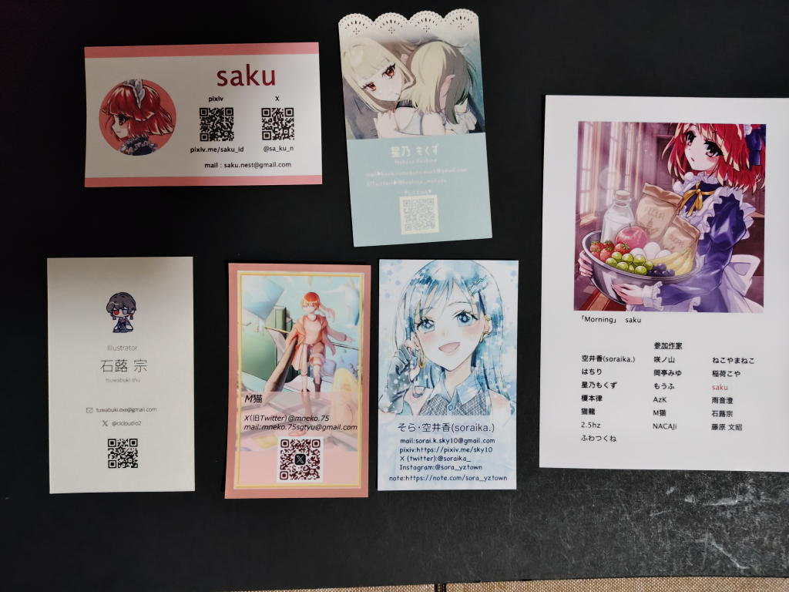

---
tags:
    - exhibition
date: 2026-10-03
---
# Illustration exhibition(2026.September) スイーツ・ファンタジー~甘い香りに想いを添えて~
- 訪問日: 2026-10-03
- 場所: [RECTO VERSO GALLERY](./recto-verso-gallery.md)

## きっかけ
<https://note.com/sora_yztown/n/n6426da790ed1>

この記事が[私の書いた昨日のArtist guildの記事](https://note.com/ks_room1215/n/n1a0aa9845408)の関連欄に表示されていた。

気づいたのが会期の最終日というのもあってとりあえず行ってみることに。

## 経過
ギャラリーのホームページにもあるのだが、なかなか古風な出で立ちのビルで入口のドアも閉じていた。
ただ、昨日と同じでここで引き返すわけにもいかないとドアを開けて中に入ってみた。

はじめは会場がよく分からなくて扉が空いていて人のいそうな場所に行ってみたら
全然関係ない事務所みたいなところだった。

会場は401号室、原画を購入したい場合は3階の事務所に行けば良いらしかった。

で、会場のドアも閉まっていて中の様子が分からなかったのだが、意を決して開けてみると
無人の一室の壁面に作品が飾られていた。そうか、こういう形態もあるのか。

sakuさんという方のイラストが一番好みだったかな。古き良き美少女ゲームのメイドさんという感じがした。

<https://x.com/sa_ku_n/status/2102384463628169363>

気になった作品のイラストレーターさんの名刺を頂いて、感想ノートに「来ました！」と書いて会場をあとにした。

敬称略

- saku
- 石蕗宗
- 星乃もくず
- Mねこ
- そら・空井香

