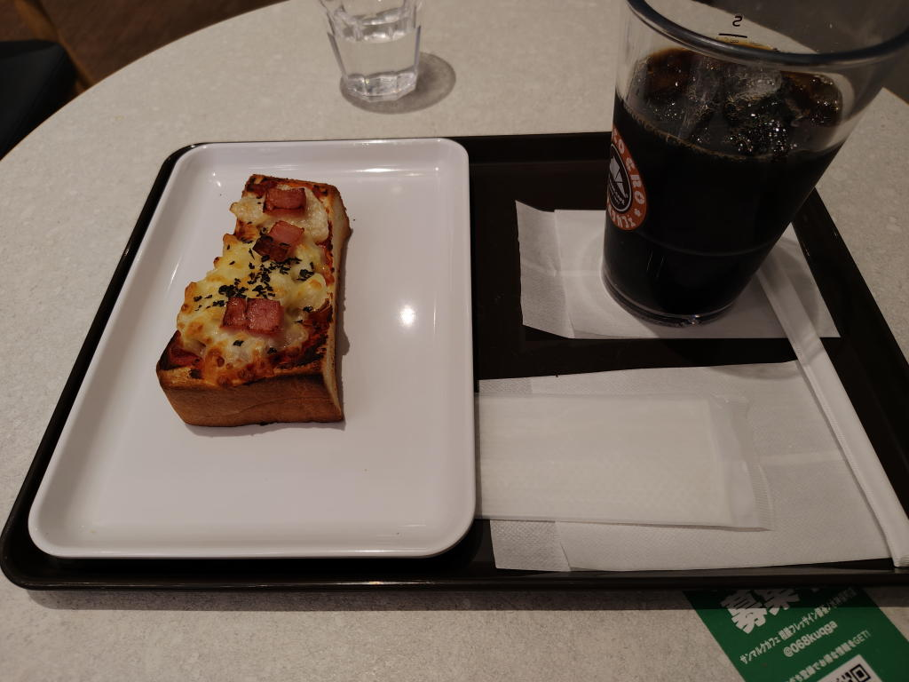
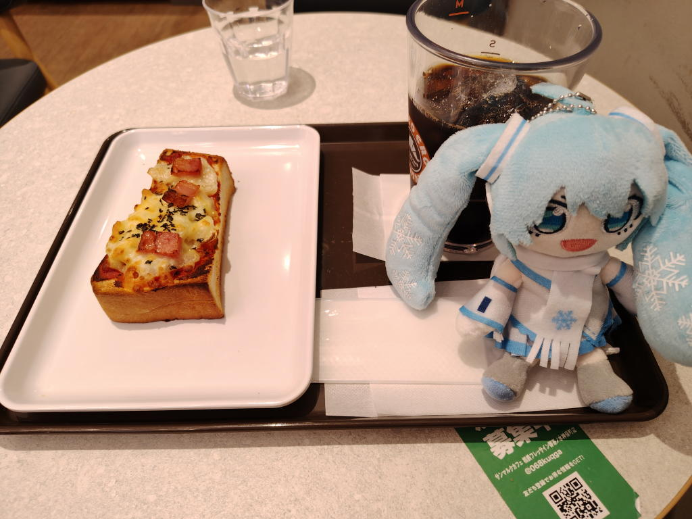

---
tags:
    - dining
---
# サンマルクカフェ
## 2026-08-31
神保町の三省堂近くにある店を訪問。

- セルフレジが2台設置されていて注文するとオーダー番号の書かれたレシートが出てくる
- 後は番号を呼ばれたら受け取りに行くだけ
- wifiも使える
- 水はセルフサービス
- トレイはゴミを分別、飲み残しというか氷を捨てて下膳口に持っていく
- 先に席取りしてから注文しても良さそう。というかそうしている人のほうが多いかも。

ぬい活デビューもした。

## バジル香るベーコンピザトースト アイスコーヒーS
ランチのセットで\550。

トーストは拍子抜けするほど小さかったけど味は美味しい。まあ、安いしこんなものだろうか。
コーヒーは苦味が強くて好みだった。

