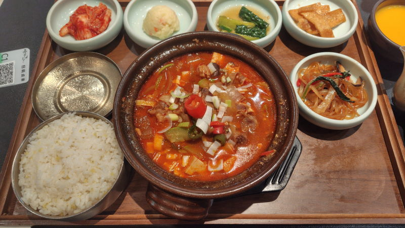

---
tags:
    - shanghai
---
# 山茶花
Shāncháhuā。カメリア

韓国料理屋

QRコードがあったのだが、画面が読み込めず注文できない。
ただ、隣の客は普通にアプリで頼んでいたような感じがする。
使っているスマホと相性が悪いのかもしれない。

ただ、入店した時にメニューが渡されるし、それで注文することもできて、
入り口にレジみたいのがあってAlipayのQRをかざすと普通に支払うことができる。

## 牛肉大酱汤定食 Niúròu dà jiàng tāng dìngshí
45元。

