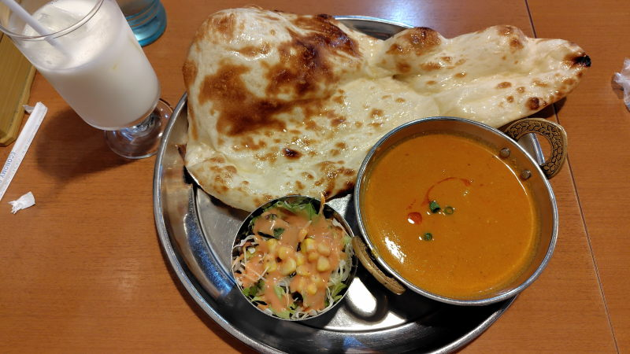

---
tags:
    - tokyo
---
# インドレストラン&バー シータラ
綾瀬駅近くにあるカレー屋。
シータラというのはヒンディー語で星という意味だそう。

カウンターは3, 4席あって残りはテーブル席。
クレジット、電子マネー諸々対応している。

## クイックランチ
税込み880円。

8種類+日替わりの中からカレーを1種類、ドリンクも色々あるけど1つ選べる。
主食はナンorライス。

チキンカレー+ナン+ラッシーにしてみた。
とにかくナンがでかい!!!

昼前だったからかそれほど混んでいなかった。

## 訪問履歴
- [2026-07-27](./blog/posts/2026-07-27.md)

