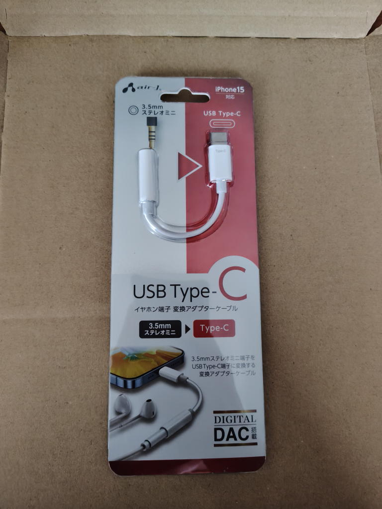

---
tags:
    - lifestyle
---
# スマホを買ったらイヤホンジャックがなかった
2026年8月19日、新しいスマホ(Aquos sense10)を買って
初めてのお出かけをしようと思ったらイヤホンジャックがないことに気づく。

イヤホンは消耗品と考えている私は500円くらいの激安イヤホンを
いくつかストックしているのだが、これでは使うことができない...

おそらく最近の主流は無線なのだろう。あるいは調べていると
TypeCに接続できるイヤホンというのも出てくる。

ワイヤレスは何年か使うとバッテリーがダメになってしまうのがマイナスポイントなのだ。
処分も面倒だし...何年も前に買ったイヤホンが未だに手元に残っている。

それで、Type-C - 3.5mmジャックの変換ケーブルを購入した。

とりあえずこれでイヤホンは使えるようになったのだが、
私は時代に乗り遅れているのかもしれないと思わせられる一件だった。
