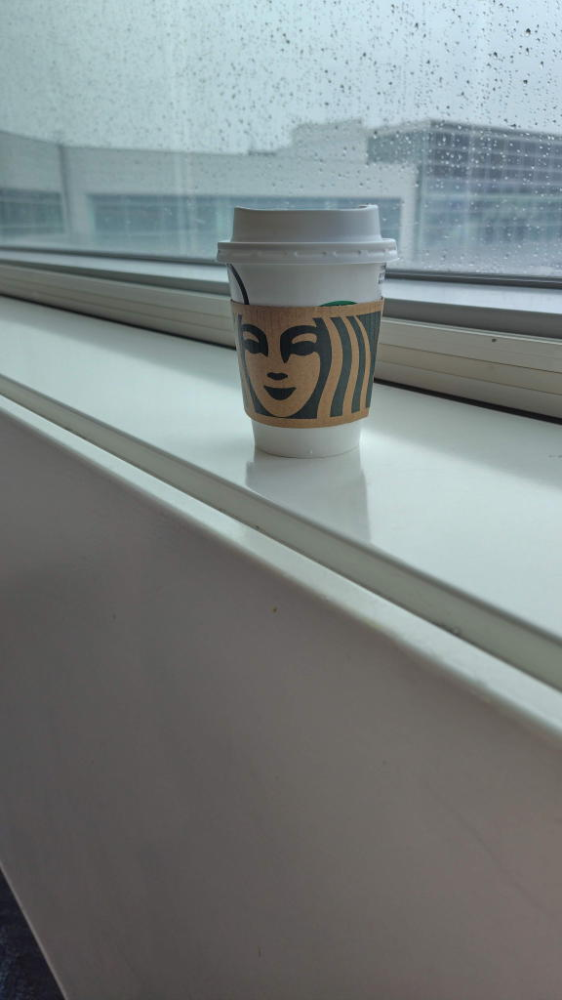

# はじめてのスターバックス
## はじめに

これはピーター・エルボウの『自分の「声」で書く技術』を読んで、20分間フリーライティングで一気に書き起こした文章です。

<https://eijipress.co.jp/products/2331>

## 本文

1章を読んだ。ネタと言ってもなにかあるだろうか。そう、はじめてスタバで注文したことを記事にしようと思っていたのだ。

きっかけはハッキリとは覚えていない。ただ、中国滞在中にお金や時間の使い方をぼんやり考えていて、その時に喫茶店で本を読むというのが頭に浮かんだのだ。もともとコーヒーを飲んでいたわけではない。何となく、意識が高いと言うか、カフェインが嫌だったのだ。何となく、体に悪そうな感もあった。でも、喫茶店で静かに本を読むという時間に何となくのあこがれがあった。中国から一時帰国していた時に、喫茶店77というような本を見つけたのだった。買ってないけど。

ただ、私はスタバにすら入ったことがなかった。コーヒーはなにかの機会で目の前に出されれば飲むというくらいだった。飲むことはできた。ミルクも砂糖も面倒だから入れない。それに体に悪そうだから入れない。でも、コーヒーに対する憧れ、情景で言うと来生たかおの「おだやかな構図」だ。あんなのにあこがれるのだ。それでコーヒーを飲むためにめちゃくちゃ調べた。中国で。公式サイトの注文方法やメニューを見て勉強した。ブリュードコーヒーとホットコーヒーの違いを調べた。

「ブリュードコーヒーのトールのホット！」

これを頼めば良いのだなと学びを得た。

さて、それじゃあコーヒーを飲もうと思い立ったのは東京から札幌に帰省するときだった。搭乗口の近くにスタバの出店みたいのがあって、時間もあるしここでやってみるか、とカウンターの近くまで行ってみた。メニューを見ると、あった！ブリュードコーヒーだ！Brewed...やるしかないと思いレジに並んだ。自分の番が来た。

「ホ、ホットコーヒーのトール」

言えた。頼めた！ブリュードじゃなくてホットって言っちゃったけど通じた！支払いはクレジット。多分一番スタンダードなメニューだからだろう。待つまでもなくすぐに出てきた。（カワイイ）店員がこの豆はなんとかかんとかと教えてくれたがよく覚えていない。

で、コーヒーを受け取った。何かダンボールが巻かれていたのは空気の熱伝導率の低さを利用した断熱材だろう。ここからが次の問題だ。紙コップの上のこの謎の蓋からどうやってコーヒーをすするかだ。蓋を取ってそのまま飲むのは何となくダサい感じがする。でも、容器を観察すると押入口みたいのがあって、そこに飲み口の蓋みたいのを押し入れると飲むための穴が空いた。

これは傾けても漏れてこないのか？どのタイミングで熱湯（コーヒー）が口に当たるのだ、熱くないのか?色々考えながら意を決してカップを傾ける。

飲めた。何ということもない。「ふつう」としか言いようもないが飲めた。

やったやったと味も何もそっちのけでスタバのコーヒーを飲んでいる自分に悦に浸りながらコーヒーを飲む。しかし、ここは空港のスタバ。本来のスタバは席取りもあるはずでこれではスタバに行ったとは言えないかもしれない。

などと考えている内にスタバコーヒーを飲み干す。最後の一口は出てこなかったから蓋を開けて飲み干した。カップはそのへんのゴミ箱に捨てた。

これがわたしの初めてのスタバ、初めてのコーヒー体験だ。

## 注

喫茶店77というのは

<https://www.j-n.co.jp/books/978-4-408-65086-9/>

のことです。帯に77と書いてあったのが印象に残っていたのかな。

来生たかおの穏やかな構図は

<https://www.youtube.com/watch?v=nO9hUFEAKoU>

聞いてみてね。
