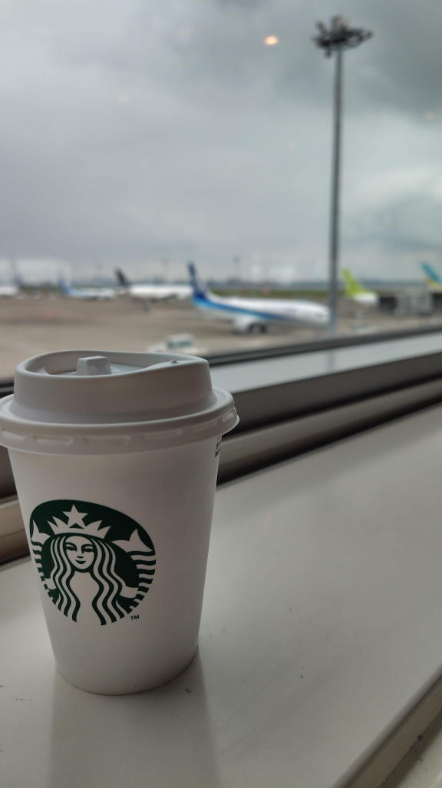
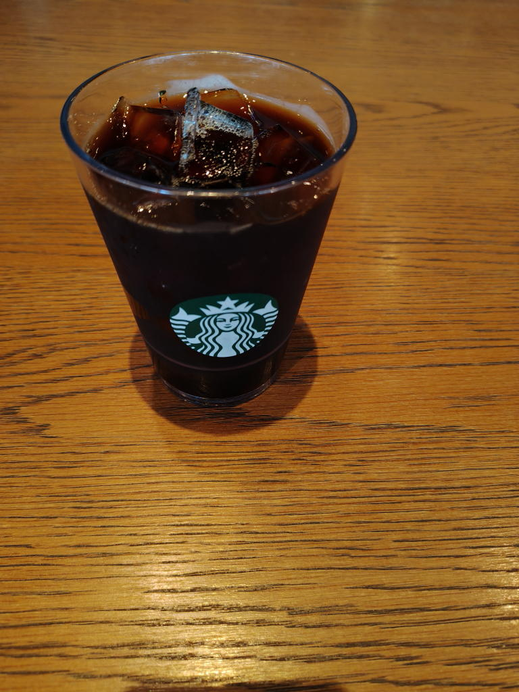
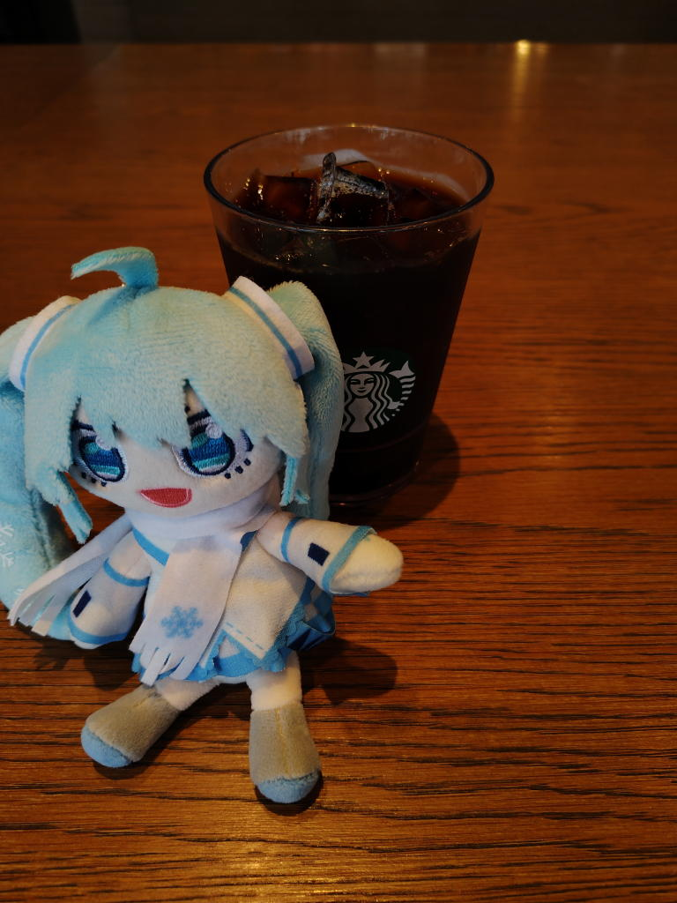

---
tags:
    - dining
---
# スターバックス
## ブリュードコーヒー ホット

これは2026年5月1日に羽田空港の待合室でスタバ処女を卒業した時に飲んだ。
味がどうこうと言うよりは注文できたことが嬉しかった、かな。

## アメリカーノ アイス
2026年7月7日。これも帰省する際に羽田の待合室にて。

[Luckin coffiee](./luckincoffee.md)で美式を飲んでいたからこっちのも飲んでみる。
エスプレッソのお湯割り。\452。味の違いは良く分からないけど価格は3,4割高い。

## ブリュードコーヒー アイス
2026年9月14日 お茶の水店にて。メニューを見てもよく分からなくて「アイスコーヒーのトール」と伝えてみたら
これが出てきた。初めて普通の店を利用して、店の真ん中あたりにある細長いテーブルの空いている席に座って飲んだ。

店頭のメニューを見るとブリュードコーヒーのアイスが正式名なのだろうが
レシートにはアイスコーヒーと書いてあった。何とも良く分からない。

渡される時にイタリアンブレンドがどうとか教えてくれた。あと、お手洗いを使うための暗証番号もレシートに書いてくれた。

ミクちゃんを取り出すときはこんな程度で恥ずかしがっていてはいけないという想いで頑張る。

店内用グラスに入れてくれた。エコでいいなと思った。
ストロー要りますか?って聞かれてこれもエコを考えて要らないと答えてちびちび飲んでいたのだが、
最後の方で傾けたら氷が一気に押し寄せてきて少しこぼしてしまった。

ザックに少しかかった...シミにはなってなさそうだけど。
ズボンにかかったのは撥水性が良すぎて全部弾いてくれた。
ストローは要るみたいだ。

## その他メニュー
- コールドブリューコーヒー 水出しコーヒーと思われる
- ラテ エスプレッソ+ミルク

あとはTEAとか色々あるけどよく分かっていない。

## メモ
2026年9月15日の未明にmisskeyでつぶやいていた内容。

- スタバの接客は良いと行くたびに思う
- レジか見える席を取ることでテキパキ働く店員さんのスマイルが見れて幸福度が上がるというスタバハック。
- アイスコーヒーを飲むときはストローをもらう、上述の通り。

## 関連
- [初めてのスタバ](./star-bucks-first-time.md)
