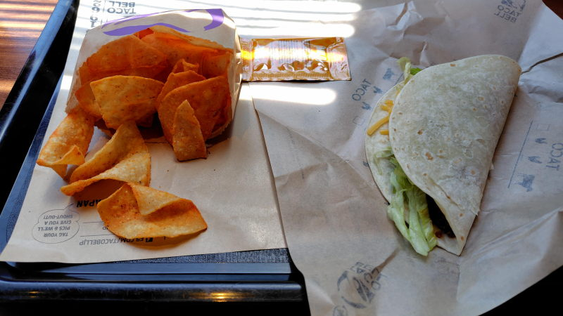

---
tags:
    - tokyo
---
# タコベル
アメリカ発のタコスチェーン店

## 2026-07-25
神保町店。とりあえず一番スタンダードな感じのビーフタコスセットを頼んでみた。

- ソフトビーフタコス
- ナチョチップス
- 烏龍茶

\780なり。会計を済ませたらレジ脇で待っているとマックみたいな感じでトレイに載せられた状態で渡される。
1階席は埋まっていたから二階へ。昼前だったからか誰もおらず、窓際のカウンター席に座る。

ナチョチップスというのはドリトス？ドンタコス？みたいなお菓子だった。
タコスは美味しいのだけれども、1つじゃ全然足らないな。

## 訪問記録
[2026-07-25](./blog/posts/2026-07-25.md)
