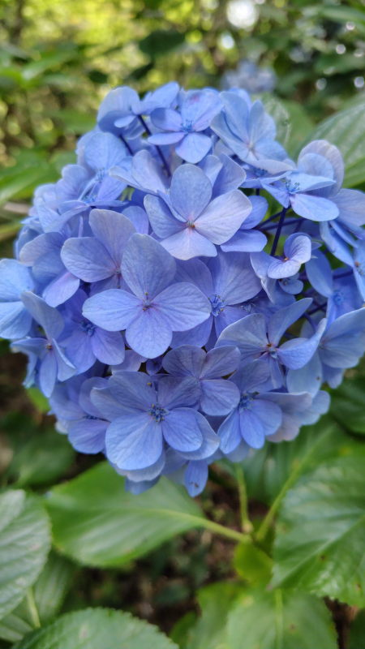
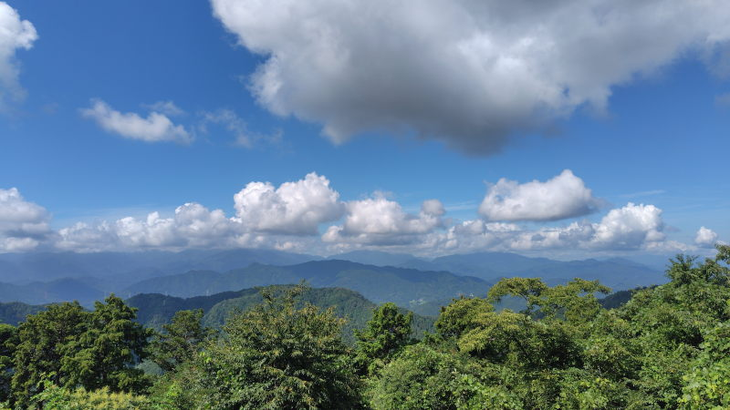

---
tags:
    - hiking
date: 2026-08-08
---
# 高尾山登山 14回目
中国から帰国というか、中国での研修を終えてから初めての登山をした。
ジョギングをして体力をある程度戻して、
処方されていた薬の副反応にも慣れてきたしそろそろ大丈夫だろうと判断したのだ。

[高尾山](./takaosan.md)、1号路からだが無事に登って降りることができた。
この日は富士山は雲に隠れて見えなかったが、まあ、それが目的ではないから良しとしよう。
ただ、早朝とはいえやはり暑かった。

途中、家にずっと放置されていたお守りを返納した。
大抵の神社なら返納する場所があるのだろうが、意外とどこにあるのか見つけられずに困っていたのだ。

紫陽花が咲いていた

富士山は見えず

