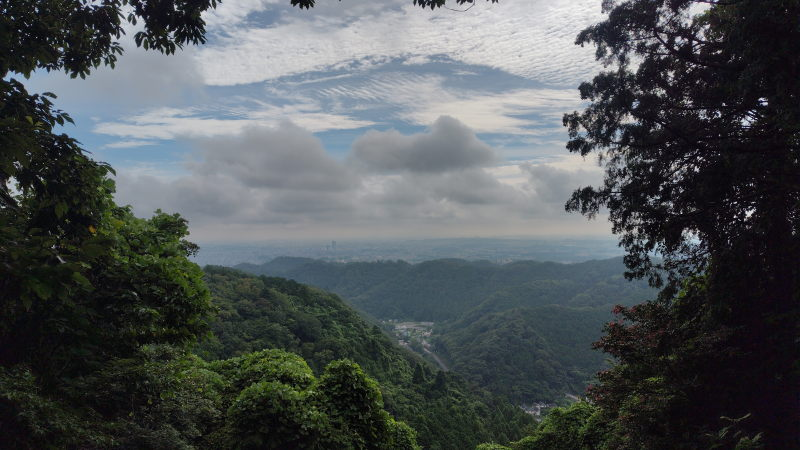
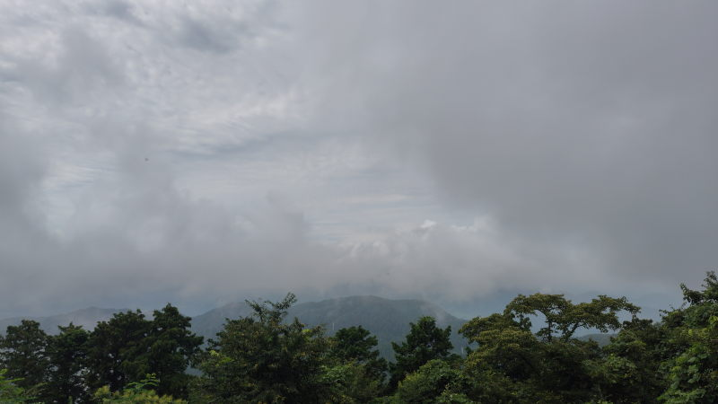

---
tags:
    - hiking
date: 2026-08-17
---
# 高尾山登山 15回目
適応障害と診断されて療養中の身ではあるのだが、[高尾山](./takaosan.md)へ行くことにした。
家に籠もっていても辛いだけだし、体力を落とさないために運動はするようにと
医者からも言われていたのだ。

端から見たら「なんだ元気じゃないか」と思われるかもしれない。
実際、会社に行けないのはどうしても行けと背中を押すような人がいないからだとも思う。
ただ、会社に行っても仕事ができるようなメンタルではないし、
もっと言えば、今この会社のためになにかをしたいという気持ちも起こらないというのが
正直なところだ。

今はとにかく考えるための時間がほしい。
そう言ってもう一ヶ月半経つのだが...

十分な蓄えがあるというのが却ってダメなのかもしれない。
高等遊民というやつか、切羽詰まって仕事をする必要がないのだ。

## 京王線が安い!
まあ、前置きはここまでにして、いつも御茶ノ水からJRで高尾まで行くのだが、
前回（8月8日）に行ったときには運賃1,034円だった。どうも中国にいる間に
値上げをしたようだ。

帰りは高尾山口から神保町まで行くのがいつものパターンというやつなのだが、
こっちは650円。圧倒的に安い。

というので、今回は都営新宿線の小川町から高尾山口を目指してみることにした。
06:18発の橋本行きに乗って調布で乗り換えて07:50頃に高尾山口に到着。
千代田線からの乗り換えということもあってか、運賃537円。安い、時間はかかるが
ほぼ半額ではないか。それほど混雑もしていなくて座ることもできたし。

## 稲荷山ルートを登る
駅前にあるコンビニでパンを買おうと思ったのだが、朝早すぎて閉まっていた。
09:00開店のようだ。仕方がないからそのまま登り始める。

前回は中国から帰国後初めての登山というのもあって一号路を使ったが、
今回は稲荷山から登ることにした。このルートが登山道らしさがあって
一番好きなのだ。

ここ何日か雨がちだったこともあってか、ところどころ泥濘んでいたが
転ぶことなく、バテることもなく登り切ることができた。

曇っていて富士山は見えなかったがもともと体力づくりのために登ったのだから
景色は二の次なのだ。山頂では家から持参したカロリーメイトを食べた。

正直、それほど楽しい気分にもなれず、エネルギー補給をしただけでそれほど長居
することもなく1号路から下山した。

稲荷山から

今日も富士山は見えず

