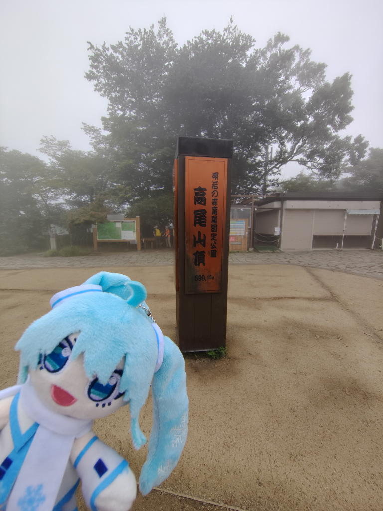
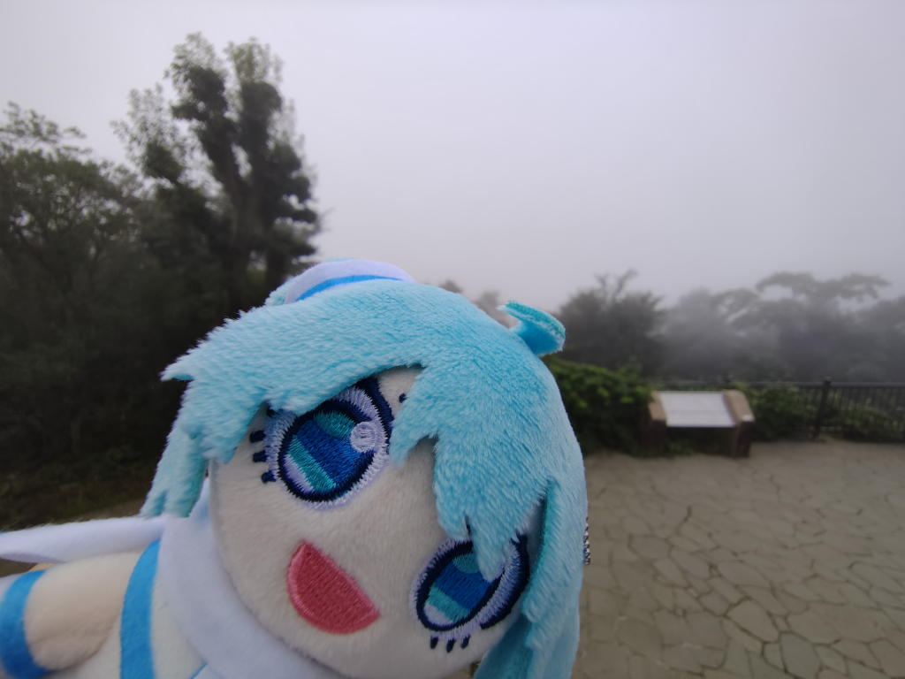
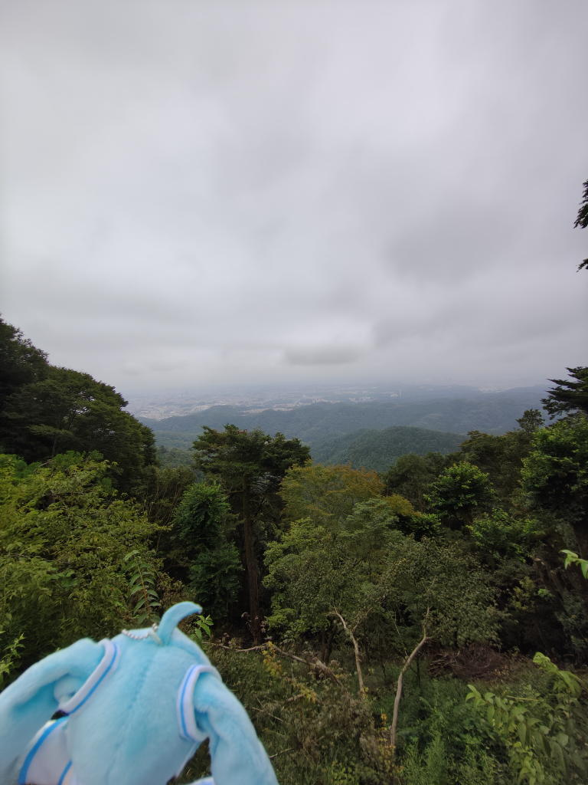

---
tags:
    - hiking
date: 2026-08-31
---
# 高尾山 16回目
[COMITIA](./comitia-157.md)や[マジカルミライ](./magicalmirai-2026.md)、メンクリ受診と色々あって出かけられず、2週間振りの登山になる。

中国で研修していた半年間、運動らしい運動を何もしていなかったから
体力づくりも兼ねてのことではあるのだが、今回はそれに加えてやりたいことがあった。

そう、マジカルミライでお迎えした雪ミクぬいと登山をする。ぬい活デビューである。

07:40、高尾山口駅に到着。いつも御茶ノ水から中央線に乗って高尾まで行っていたのだが、
前回の登山で京王線を使ったほうが遥かに安いということを学び、今回もそのルートで移動した。

天気は曇り。ぬかるみを避けるためにも舗装された一号路から登ることにする。
霧がかかっていて視界は悪かったけど、8月の割には涼しくて心地よく歩くことができた。

09:00、山頂に到着。眺望は全くなし!でも良いのだ。今回の目的は景色ではなくて
ミクちゃんと写真を撮ることだから。

かばんの中からぬいを取り出して写真を撮ってみる。

おー...下手っぴだ。でも、こうしてミクちゃんと写真を撮るといつもの高尾山が全然違って感じられた。
一緒に登るという楽しみが一つ増えた。

ぬいを片手にウロウロしながらその後も何枚か写真をパシャリ。
タイマー機能を使うとボタンを押さなくて済むから幾分か撮りやすいことを学ぶ。
まだまだ課題は多そうだ。

撮っている最中の恥じらいみたいのは思いのほか少なかった。こういうことに鈍感でいられるのは良いことだと思う。
好きなことに正直に生きていたいのだ。

気の済むまで写真を撮って持ってきたパンで栄養補給をしてさっさと下山、
そのうち霧も晴れてきて東京の町並みが見えるくらいに回復していた。

10:15、高尾山口駅に帰還。

神保町の[サンマルクカフェ](./saint-marc-cafe.md)でランチ。
