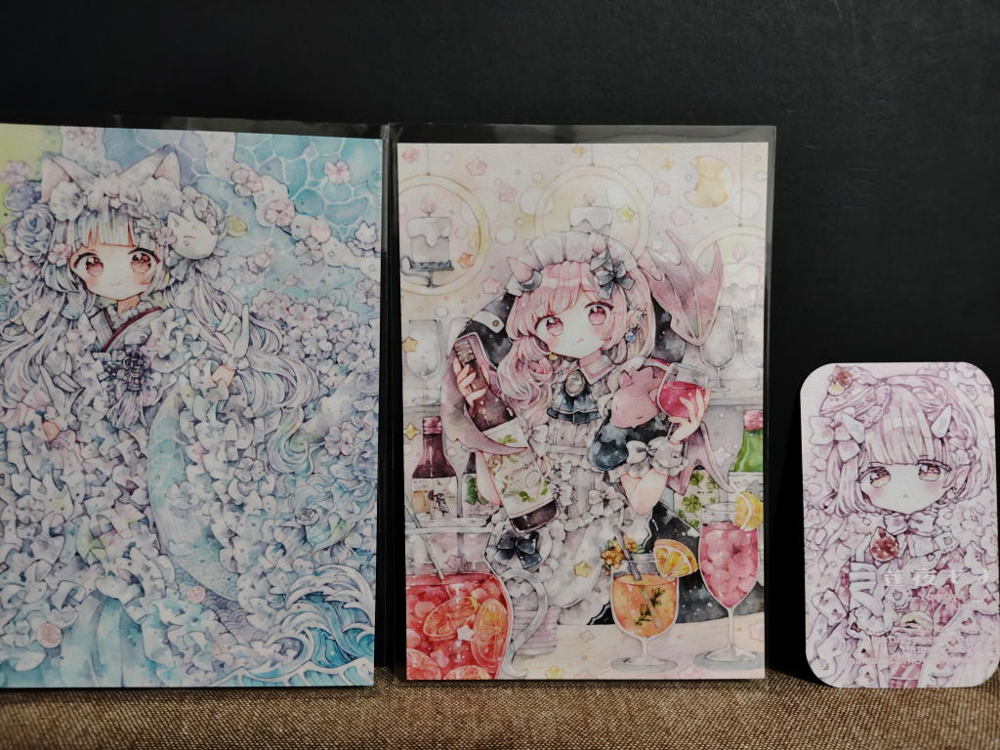
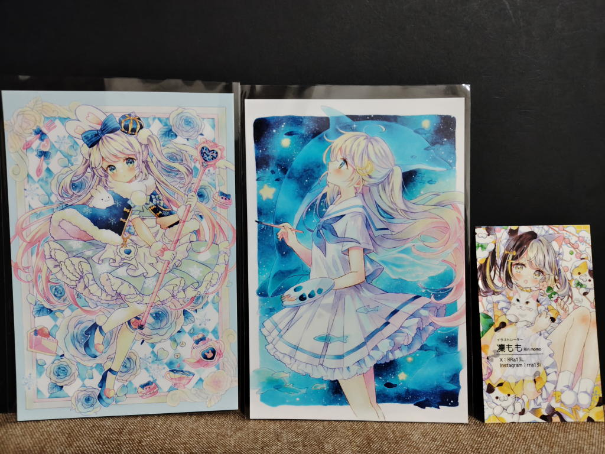
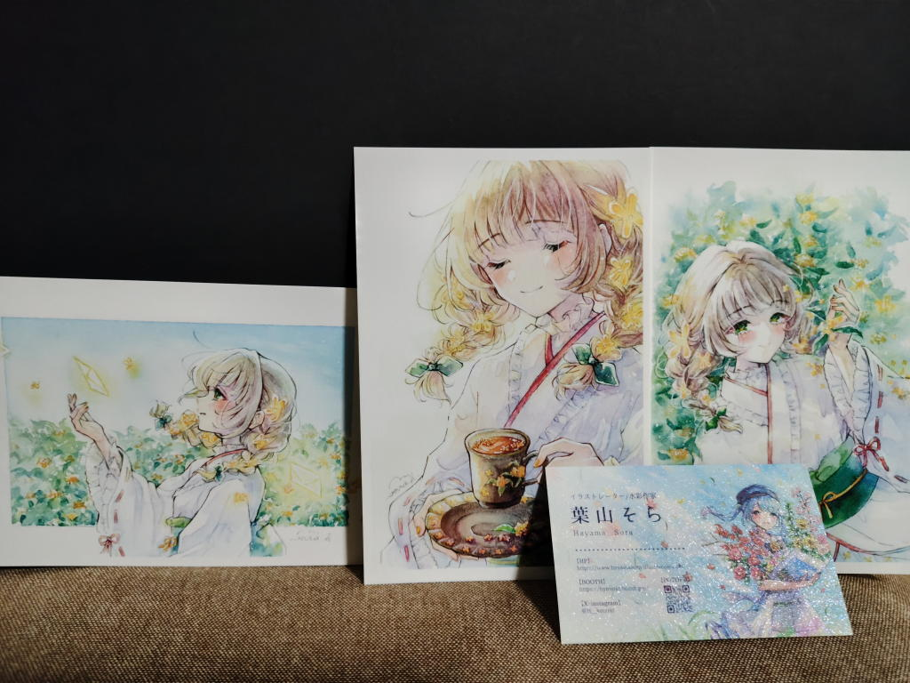
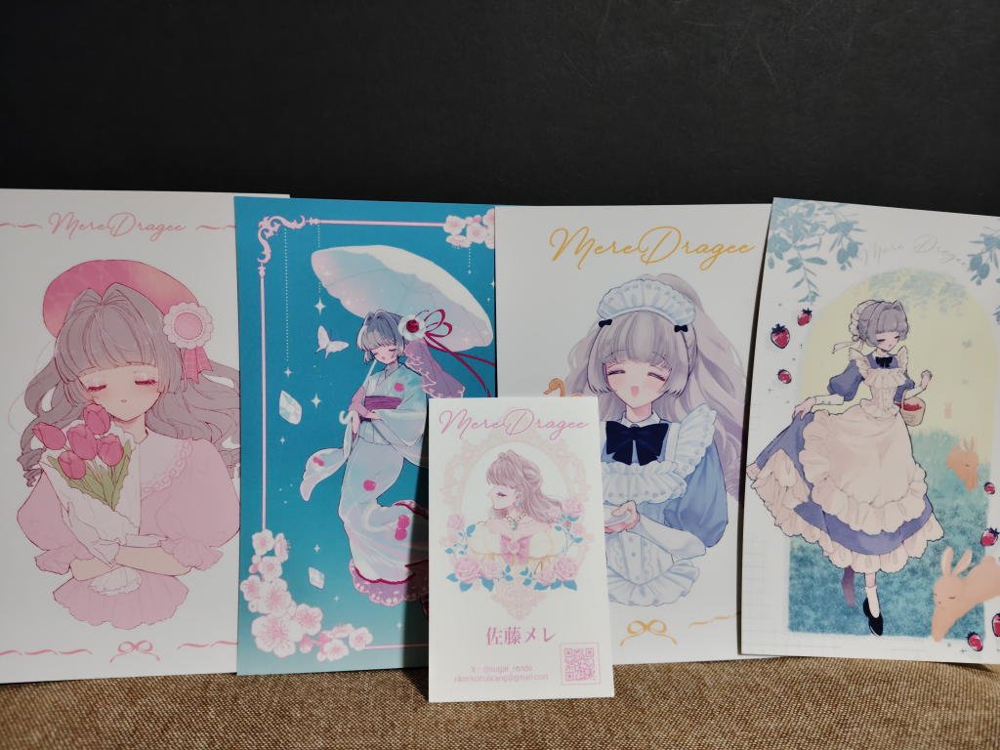
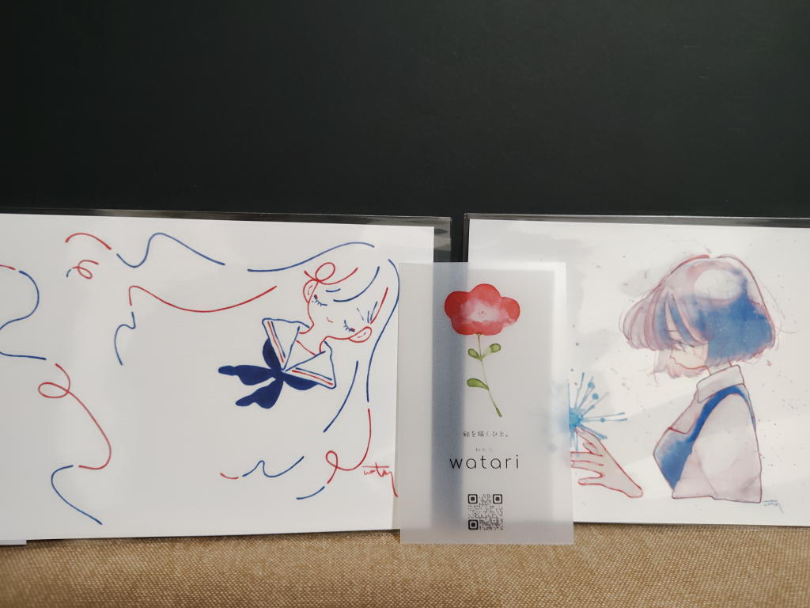
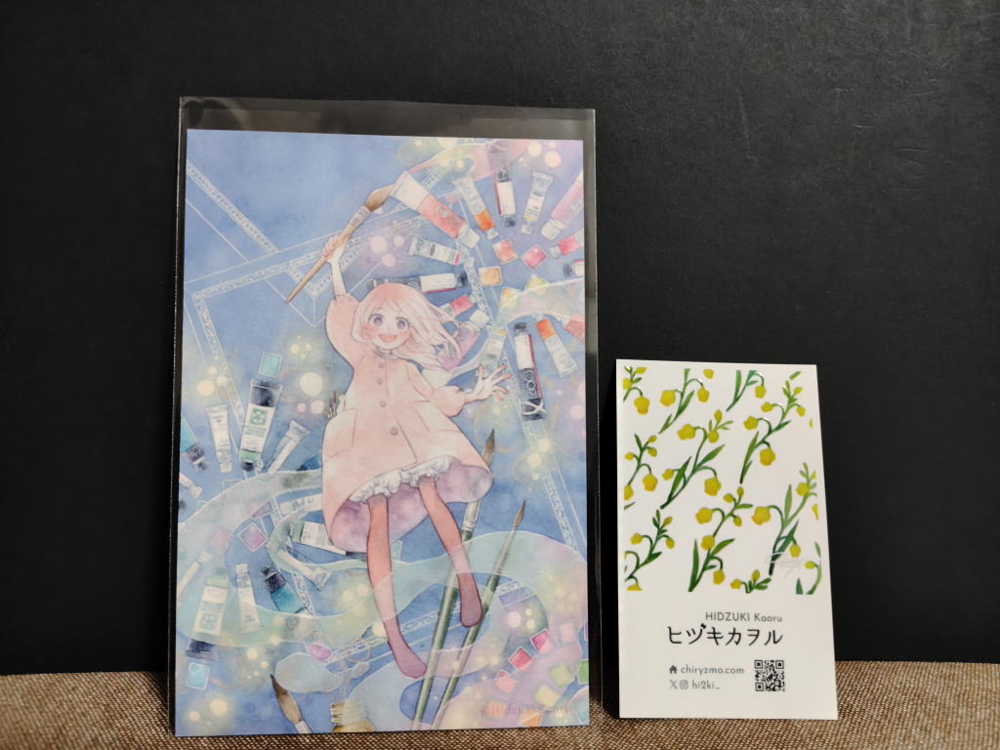

---
tags:
    - event
date: 2026-10-04
---
# TAMAコミ 2026年10月4日 第13回
- 訪問場所: 東京たま未来メッセ（京王八王子駅から徒歩3分くらい）

13:40ごろに会場入り、COMITIAと比べると控えめな規模感で、
全体を一通り見て回って、気になっていたブースで買い物をして大体1時間くらいの滞在だった。

このあと[文房堂のなつきさんの個展](./bunpodo-20261004-natsuki.md)に行ったのだが、
なつきさんご本人のブースもあって少し驚き。何も買わなかったんだけど、
文房堂より品揃え豊富だったし、こっちで買えばよかったなと少しだけ後悔...

## お迎え品
### くらげの森のアリス
<https://x.com/moyo_moy02>

### 凜もも
<https://x.com/RRa13L>

### 葉山そら
<https://x.com/H__ymSrkt>

### 佐藤メレ
<https://x.com/sugar_ronde>

### watari
<https://x.com/nijimukiokuiro>

### ヒヅキカヲル
<https://x.com/hi2ki_>

