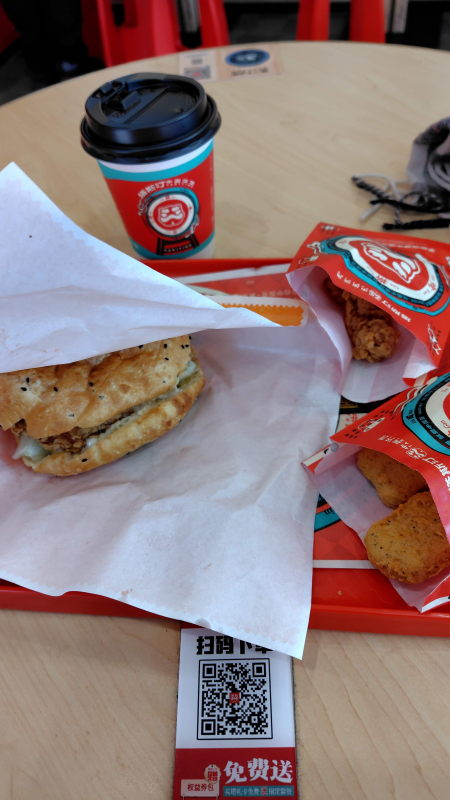

---
tags:
    - tianjin
---
# 塔斯汀汉堡
Tǎ sī tīng zhōngguó hànbǎo

中国発のバーガーチェーン。

テーブルのQRコードを読み込むか、
WeChatでミニアプリを検索して起動後に店舗を指定して注文すると
オーダー番号の書かれた画面が表示される。

画面に完成みたいな表示が出たらカウンターに受け取りに行けば良い。

# セットメニュー
人气单人4件套 17.9元。バーガーとサイド、ドリンクはある程度選べる。午年限定のセット

- ハンバーガー
- チキンナゲット
- ドラム
- 稻香马蹄饮（シログワイ）

