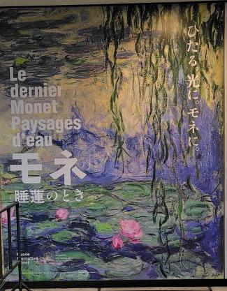

---
tags:
    - exhibition
date: 2024-10-18
---
# 国立西洋美術館 モネ 睡蓮のとき
週末天気が悪そうというのもあって夜間開館の特別展へ。

夜は空いていることが多いのだが、さすがモネというべきか多くの人で賑わっていた。
同じ景色を時間や季節を変えて何度も描く、そういう変化を捉える凄さが
作品を見る度に伝わってきた。

晩年は眼病を患っていたようで線の運びも変わってきていたように感じられた。
それも含めてということかもしれないが、でも、病気になる前の作品のほうが
良さが伝わって来たように思えた。

睡蓮は特に朝や夕方の作品が気に入ったかな。キスゲという花を中心においた作品があって
力強さみたいなものを感じた気がする。

## キスゲ
<https://www.marmottan.fr/notice/5097/?is=true>
## 睡蓮（1907年）
<https://www.marmottan.fr/notice/5168/?is=true>
## 睡蓮（1916-1919年ごろ）
<https://www.marmottan.fr/notice/5164/?is=true>
## 睡蓮の池（1917-1919年ごろ）
<https://www.marmottan.fr/notice/5165/?is=true>

## リンク
<https://www.ntv.co.jp/monet2024/>
