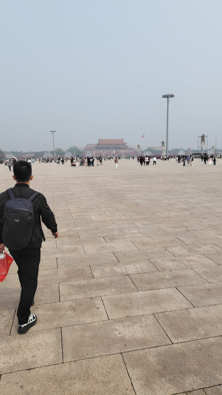
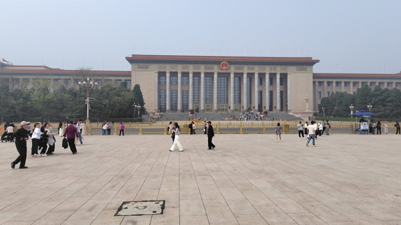
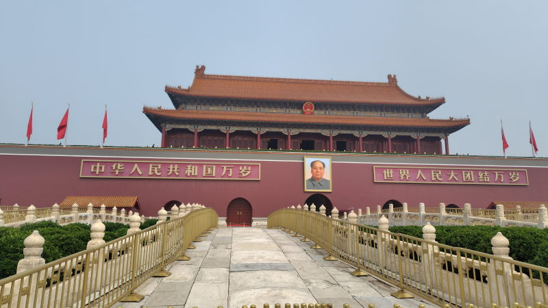

---
tags:
    - beijing
---
# 天安門
## セキュリティチェック
入場人数に制限がかかっていても大行列ができる。
09:10くらいから並び始めて何度もパスポートを見せたりしながら
ようやく荷物検査場にたどり着いたのは10:45頃だった。

かばんは持っていかないほうが良いが荷物検査がスムーズになると聞いていたが、
みんな同じことを考えているのか、かばん有りの人が並んでいる列のほうがスムーズに流れている感があった。
ポケットの中身をすべて出してボディチェックを受ける。

## 天安門広場

## 人民公会堂
天安門広場の西側にある大きな建物

## 天安門
行列ができているのはこの門を写真に撮るため。

門を抜けると[故宮](./gugong.md)がある。
