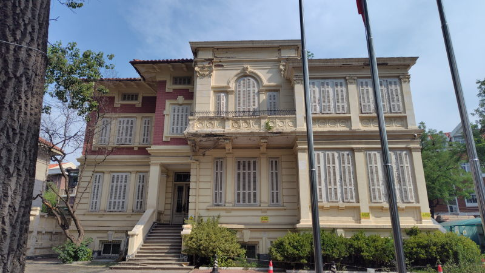
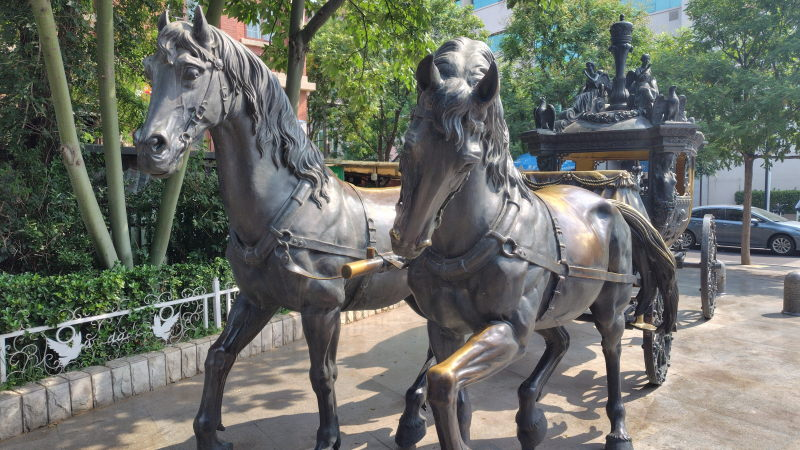
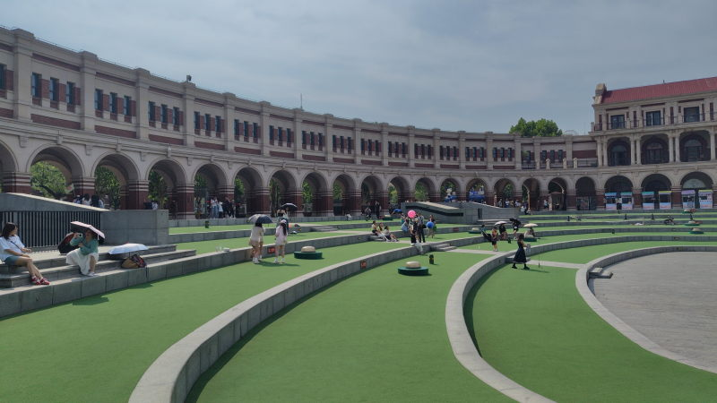

---
tags:
    - tianjin
---
# 天津五大道
Wudadao

天津駅近くにある観光地。

租界時代の建物が残っている4A観光区。

確かに古風な洋館が多く建っているのだが、建物が多すぎて
かえって見どころがどこなのかよくわからないという感じもした。

真ん中あたりの民园广场を目指して歩くといい。

## アクセス
マンションからなら地下鉄で

体育中心-下瓦房で1号線に乗り換え-小白楼 B出口。
