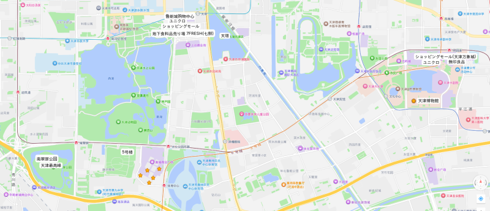
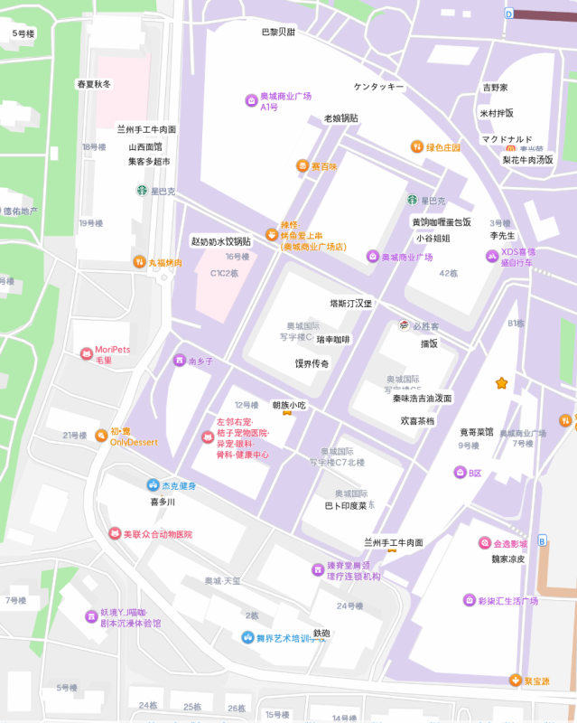
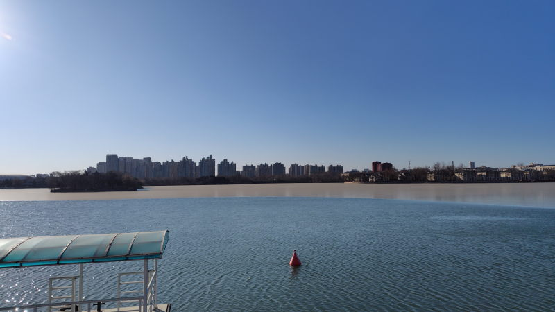
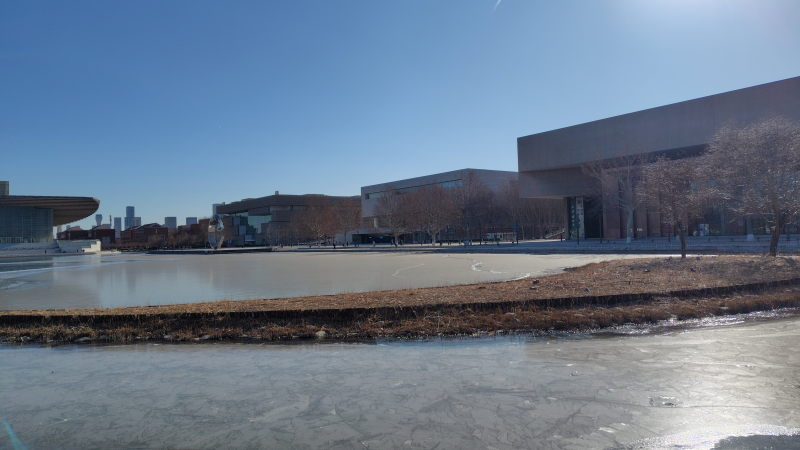

---
tags:
    - tianjin
---
# 天津

## 时代奥城 Shídài ào chéng

### スーパー・コンビニ
#### 集客多超市
最寄りのスーパー。小さい店だが24時間営業で
日用品、お菓子、飲み物...必要なものはおそらくここで揃えられる。
WeChatのバーコードを表示させてレジ員に見せるとバーコードリーダみたいので読み込んでくれる。

#### その他
- セブンイレブン :: 無人レジあり。QRコードで支払い可能
- D-MART :: 輸入品店。日本の洗剤等も買える
### パン
- [巴黎贝甜](./balibeitian.md)
### 日本料理
日本料理屋は日本と同じで店員を読んでメニュー表から注文するスタイル。
この3つは日本語が通じる店員がいる。会計は买单(mai dan)と店員に伝える。

中国系の料理屋と比べるとかなり割高。

- [喜多川](./kitagawa.md)
- [春夏秋冬](./shunka-shutou.md)
- [鉄砲](./teppo.md)

#### 牛丼
- [吉野家](./yoshinoya.md)
### 蘭州
- [兰州手工牛肉面](./tianjin-lanzhouniuroumian.md)
### 山西
- [山西面馆](./shanximianguan.md)
### 湖南省
- [擂饭](./leifan.md)
### 四川
- [竟哥菜馆](./jinggecaiguan.md)
- [小谷姐姐](./xiaogujiejie.md)
### 陝西省
- [馍界传奇](./mojiechuanqi.md)
- [秦味浩吉油泼面](./qinweiyoupomian.md)
- [魏家凉皮](./weijialiangpi.md)
### 火鍋
- [聚宝源](./jubaoyuan.md)
### 朝鮮・韓国
- [朝族小吃](./chaozuxiaochi.md)
- [米村拌饭](./micunbanfan.md)
- [梨花牛肉汤饭](./lihuaniuroutangfan.md)

### 香港
- [欢喜茶档](./huanxichadang.md)

### カレー
- [巴卜印度菜](./baboyinducai.md)
- [黄饷咖喱蛋包饭](./huangxianggalidanbaofan.md)

### 餃子
- [赵奶奶水饺锅贴](./zhaonainaishuijiaoguotie.md)
- [老娘锅贴](./laoniangguotie.md)

### ハンバーガー
- [塔斯汀汉堡](./tasiting-hanbao.md)
- [マクドナルド](./mcdonalds.md)
- [ケンタッキー](./kentucky.md)

### その他
- [李先生](./lixiansheng.md)

### カフェ(コーヒー)
- [瑞幸咖啡](./luckincoffee.md)

## 水上公園近辺
- [天津动物园](./tianjin-zoo.md)
- [鲁能城购物中心](./lunengchenggouwuzhongxin.md)
- [天塔](./tianta.md)
- [南翠屏公园](./nancuipinggongyuan.md)

公園からマンションを望む。

## 五大道
[五大道](./tianjin-wudadao.md)

## 梅江会展中心
- 天津梅江中心皇冠假日酒店 天津への出張者が使うホテルの一つ。
- 天津梅江会展中心 ここがプーチン・習近平・金正恩が会見をした場所らしい

## 老天津周辺
- [大馅锅贴](./daxianguotie.md)
- [津卫大酒店](./jinweidajiudian.md)
- [津门羊大爷铜锅涮肉](./jinmenyangdayetongguoshuanrou.md)

## 文化中心
博物館、美術館、科学館、図書館が一堂に会する場所。
日本でいうと上野公園を小さく、というか緑をなくしたような感じだろうか。

天津万象城というショッピングモールには無印やユニクロが入っている。
地下はドラッグストアと大きな食料品売り場になっている。

## メモ
### よく通っていた店・おすすめ
- [馍界传奇](./mojiechuanqi.md)
- [赵奶奶水饺锅贴](./zhaonainaishuijiaoguotie.md)
- [（遠い方の）兰州手工牛肉面](./tianjin-lanzhouniuroumian.md)
- [巴卜印度菜](./baboyinducai.md)
- [米村拌饭](./micunbanfan.md)
- [朝族小吃](./chaozuxiaochi.md)

- [竟哥菜馆](./jinggecaiguan.md) 一人では入りにくい
- [魏家凉皮](./weijialiangpi.md) 混んでいて入りにくい
