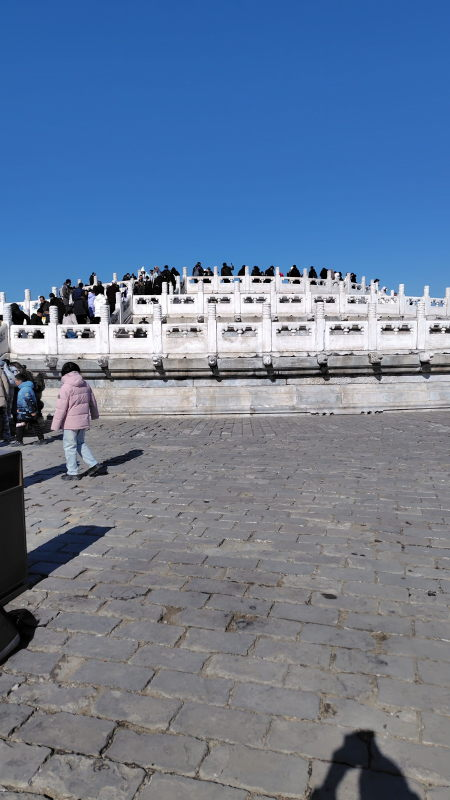
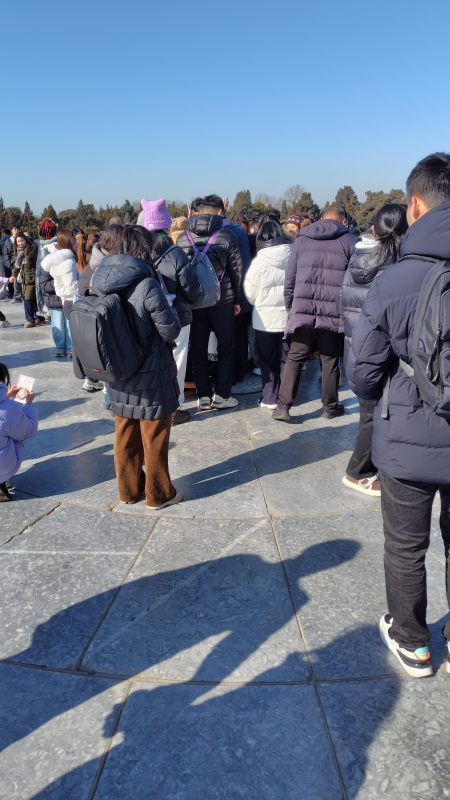
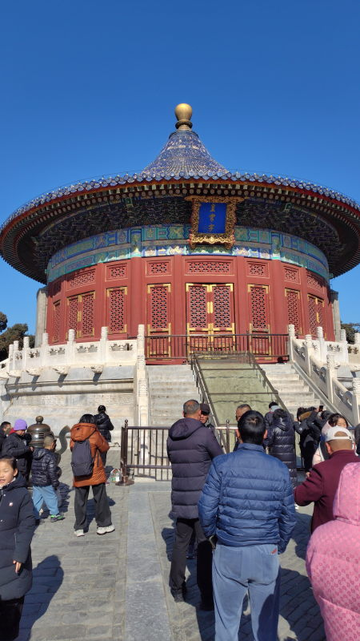
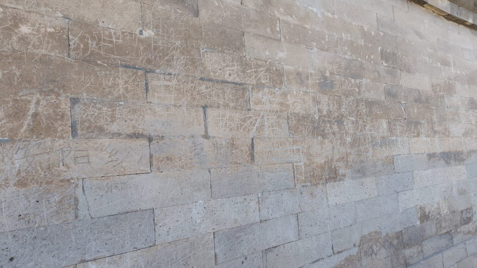
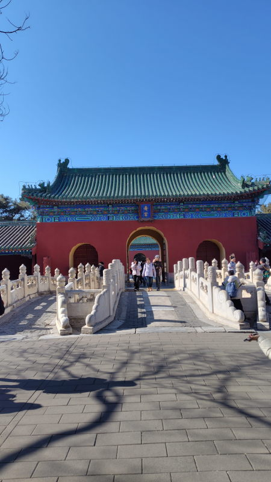
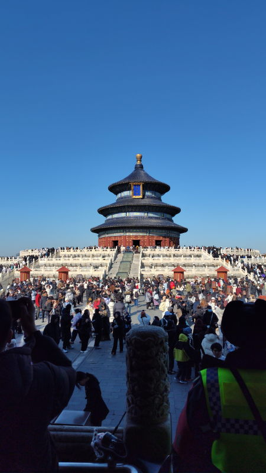
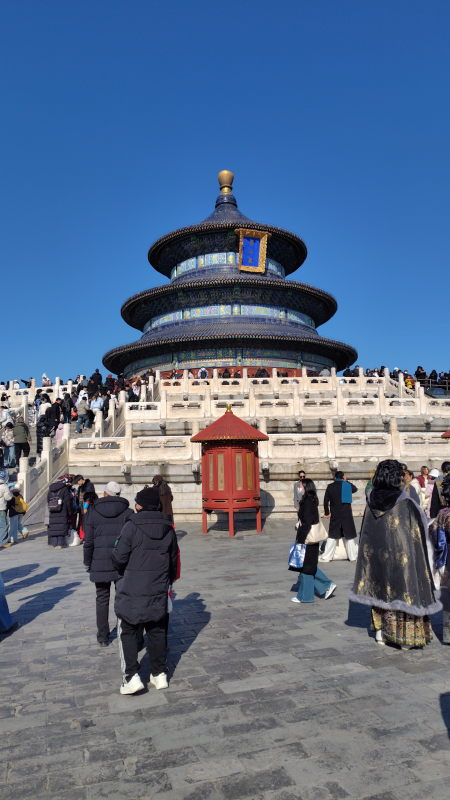

---
tags:
    - beijing
date: 2026-02-08
---
# 天坛公园
Tiāntán gōngyuán。世界遺産

## アクセス
地下鉄 景泰站から徒歩。

## 圜丘 Yuán qiū
円形の台座のようになっている場所。
上まで登ると真ん中に人が一人上がれるくらいの大きさの丸い台があって人だかりができている。
ここに皇帝が乗って豊穣の祈りを捧げていた。

## 皇穹宇 Huáng qióng yǔ
英語ではVault、宝物庫のこと。

## 回音壁 Huíyīn bì
Vaultの周りを取り囲む壁。音が反響するように計算された構造になっている

## 斋宮 Zhāi gōng
公園に西の端にある建物。
儀式の前に皇帝が断食するための場所、中は展示室になっている。

## 祈念殿 qí nián diàn
祈念殿という名前の通り、ここも(明・清)皇帝が五穀豊穣のための祈りを捧げる場所。

ここが天壇公園で一番有名と言ってもいい場所のようで人でごった返していた。

中国の伝統的?な服を着て歩いている人が結構いてSNS映えを狙って写真を撮っている。

2026年にトランプと習近平が歩いていた場所でもある。

