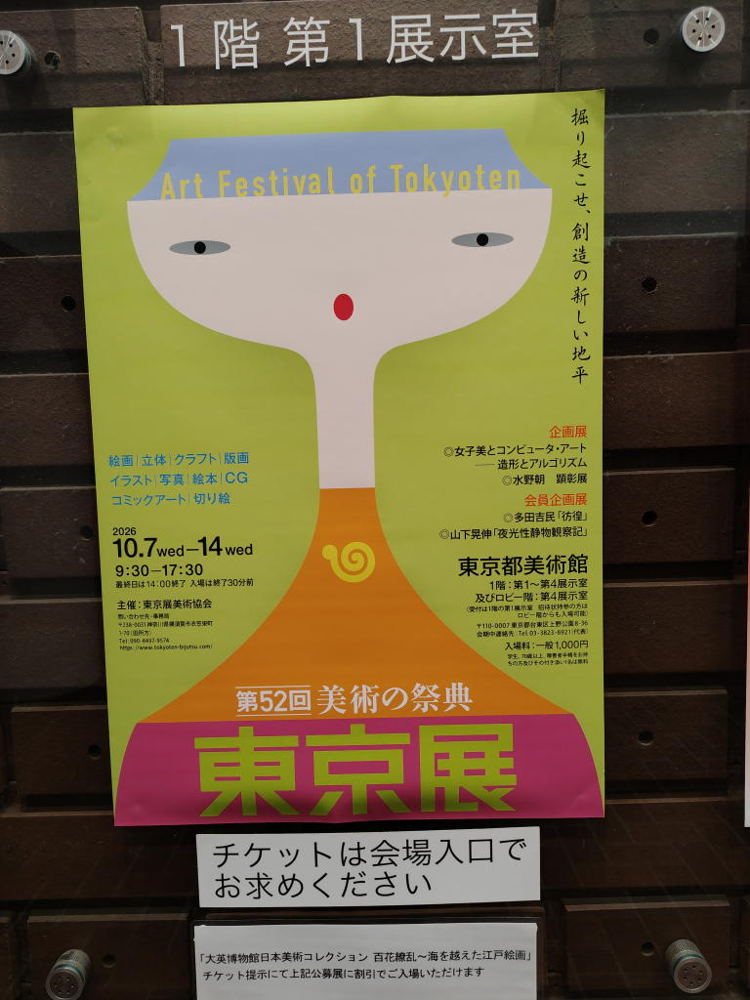
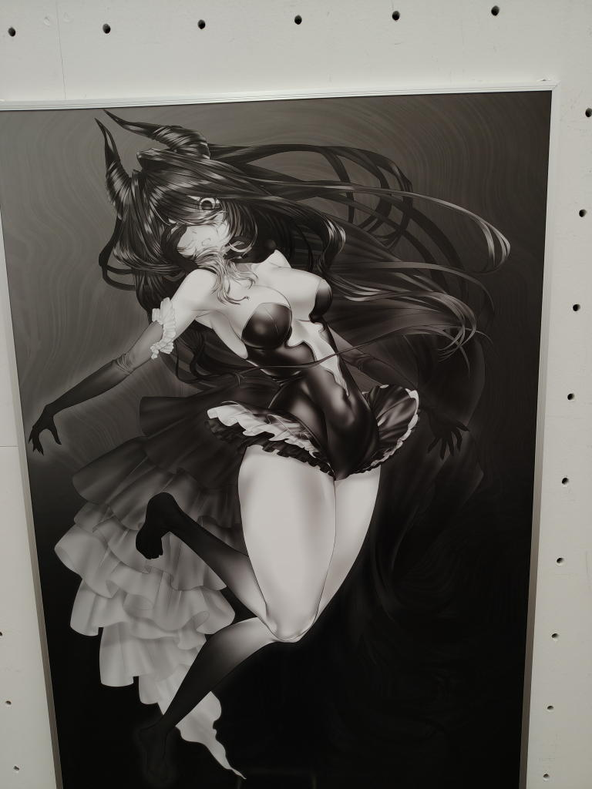
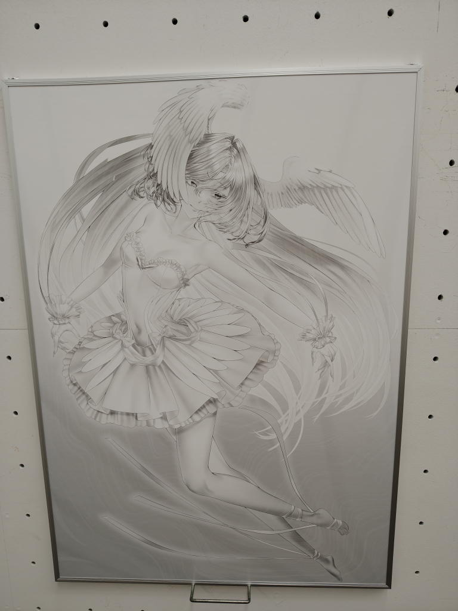
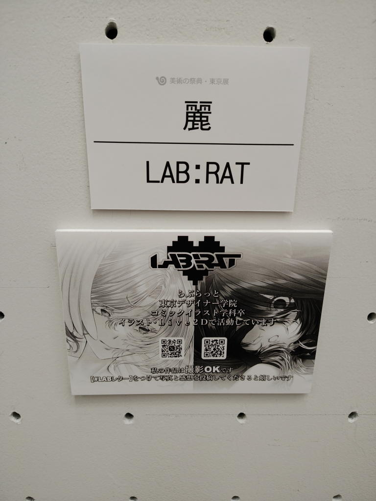
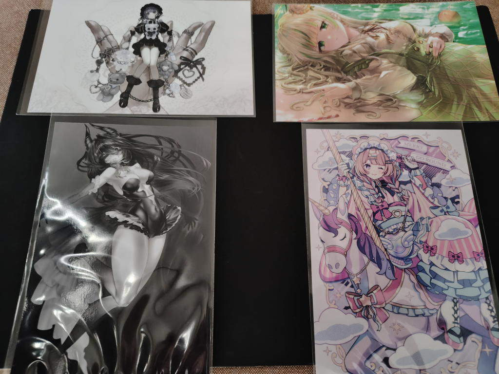

---
tags:
    - exhibition
date: 2026-10-07
---
# 第52回美術の祭典 東京展
- 訪問日: 2026年10月07日
- 場所: [東京都美術館](./tobikan.md)

## きっかけ
[ハマクリ](./hamakuri-vol3.md)にて、小夜子さんのブースに招待状が置いてあったのをもらってきた。

<https://x.com/sayosny2/status/2105999293698228666>

後で調べてみると優子鈴も出展するということを知った。

<https://x.com/_yukoring/status/2106340793493684332>

## 概要
受付ではがきを渡すとそのまま入場することができた。

色々なジャンルの作品が展示されていたのだが、はじめの方は現代アートでなかなか難しく感じるものが多かった。
何となく色彩がキレイとかそういうことは分かる、時は分かるのだが。

四室に分かれていて、現代アート（絵画だけじゃなくて立体アート?も含む）、絵本、コミックアートというような流れになっていた。

印象に残った作品を挙げておく。

### 藤倉春日 廻る
モノクロの花の絵。写真を載せていいのか分からないが、

<https://tokyoten-bijutsu.com/?p=1023>

が近い感じがする。

### 小林由佳 水底の王者
水亀だろうか。写真と見間違うほどにリアル。
ご本人がXに挙げている。

<https://x.com/k_b_y_s_y_k_/status/1834589933929173271>

### スガヌマユキノ 価値観
この方だけは調べても全く情報が出てこない。

これもまた巨大な作品で地獄か体内を思わせる真っ赤な空間の真ん中に
女性が一人全裸で裸の状態で吊り下げられている。
この女性の下に光り輝く卵か受精卵のようなものが置かれている。

外周には裸の人間が無数に描かれていて、ただ、どの人もどこを見ているというのでもなく、
もしかしたらみな死んでいるのか、どこかに助けを求めているのか...

こんなイメージがどこから湧いてくるのだろうという驚きを強く感じた。
### Nekogare 異邦-ヨル
かなり大きな作品でひときわ目を引いた。
これもXに画像があった。

<https://x.com/Magic_Hour_KK/status/2071610401524174981>

### 塩沢かれん moon light他
色使いが鮮やかでキレイだった。
ご本人と写った写真が挙げられているが、
何となくそんな気はしていたが、ちょうど私が訪問した時におられた方が作者さんだったのか...

<https://x.com/kssoruto/status/2107765357981372649>

### コミックアート
- あけいろ Little Gnome <https://www.instagram.com/akeiro1616>
- マユヒラ <https://x.com/yurari_yuhira/status/2097293876575019084>
- 桜庭すず 絵空事 <https://x.com/mer_murmure/status/2103099857217188185> これ好き!
- 小夜子 上述のとおり
- 優子鈴 上述のとおり
- ツネナみ <https://x.com/tunena__MI/status/2099454176275358060>
- 甘木花 <https://x.com/hana_amagi/status/2102337378648256933>

#### らぶらっと
<https://x.com/labrat_lab/status/2107595300047319340>

この方だけは撮影OK/投稿OKと書いていたから写真を挙げる。

## お迎え品
出口でポストカード等が販売されていて4枚お迎え。

左上から時計回りに

- ツネナみ
- マユヒラ クリームソーダの波に溺れて
- 甘木花 Merry Go Round
- LAB:RAT 麗

## リンク
- <https://tokyoten-bijutsu.com/?p=1309>
