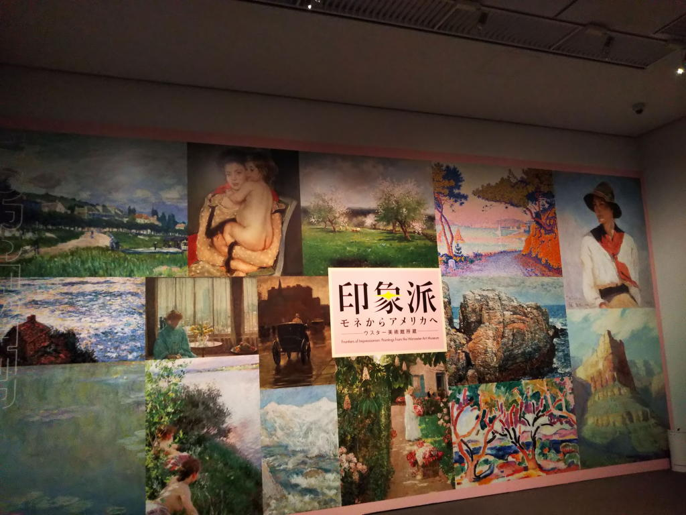
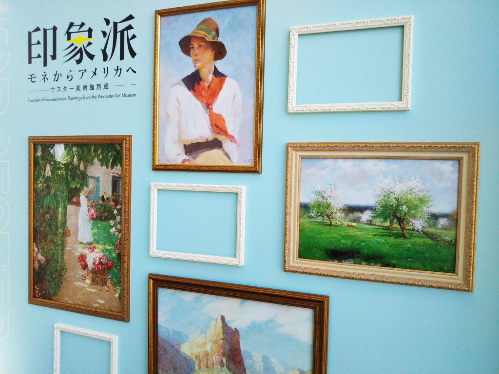

---
tags:
    - exhibition
date: 2024-02-24
---
# 東京都美術館 印象派展-モネからアメリカへ
[ウスター美術館](./worcester-art-museum.md)

作品リストを見ながら気に入った作品に印をつけておいた。
## トマス・コール アルノ川の眺望、フィレンツェ近郊
<https://worcester.emuseum.com/objects/20898/view-on-the-arno-near-florence>

入口に入って一番最初に目についた作品
## アルフレッド・シスレー 洗濯場
<https://worcester.emuseum.com/objects/19543/le-lavoir-the-washhouse>

穏やかな田舎街といった感じ、明るい希望にあふれる雰囲気。
## チャイルド・ハッサム 花摘み、フランス式庭園にて
<https://worcester.emuseum.com/objects/20384/gathering-flowers-in-a-french-garden>

ポスターなどで使われているのがこれ

## チャイルド・ハッサム コロンバス大通り、雨の日
<https://worcester.emuseum.com/objects/912/columbus-avenue-rainy-day>

実写のような作品。大恐慌時代のニューヨークの写真がふと思い起こされた。
## ヨゼフ・イスラエルス 波止場にて
<https://worcester.emuseum.com/objects/8986/on-the-dunes>

説明書きには丘で恋人の乗る船を待っているとあった。
## ジョン・シンガー・サージェント コルフ島のオレンジの木々
<https://worcester.emuseum.com/objects/9681/oranges-at-corfu>

印はつけてあるがあまり印象に残っていない...
## 黒田清輝 落葉
<https://online.bunka.go.jp/heritages/detail/92786>

落ち葉に覆われる森の小道
## 久米桂一郎 秋景
<https://kume-museum.com/gallery_kei/works/>

これは日本に帰国してから描いたようで、印象派のタッチで描かれた日本人が印象に残った。
## フランク・ウェストン・ベンソン ソリティアをする少女
<https://worcester.emuseum.com/objects/3063/girl-playing-solitaire>

1人椅子に座って机上のトランプを悩ましげに見つめる少女

この人の人物画はかなり好き。
## ジョゼフ・グリーンウッド リンゴ園
<https://worcester.emuseum.com/objects/29547/apple-orchard>

風景画の中ではこれが一番気に入った。
## ジョゼフ・グリーンウッド 雪解け
<https://worcester.emuseum.com/objects/15845/melting-snow>

## ウィラード・リロイ・メトカーフ プレリュード
<https://worcester.emuseum.com/objects/33659/prelude>

緑にあふれる風景、こんな道を歩いてみたいものだ
## セシリア・ボー ヘレン・ビゲロー・メリマン
<https://worcester.emuseum.com/objects/40160/helen-bigelow-merriman>

人物画。メガネを掛けた初老の女性
## マックス・スレーフォークト 自画像
<https://worcester.emuseum.com/objects/55573/selbstbildnis-im-garten-a-selfportrait-in-the-garden-at-go>

ダンディなおじさん
## ジョージ・イネス 森の池
<https://worcester.emuseum.com/objects/29374/pool-in-the-woods>

解説を読むと哲学的な雰囲気を漂わせたとされる作品。スウェーデンボルグのこと、不可知の神、暗い雰囲気。
## 写真

## リンク
<https://www.tobikan.jp/exhibition/2023_worcester.html>
