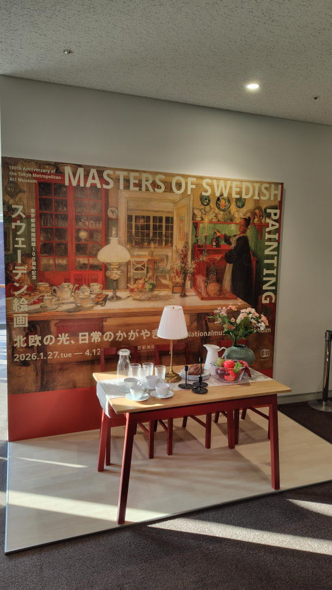

---
tags:
    - exhibition
date: 2026-02-15
---
# 東京都美術館 スウェーデン絵画 北欧の光、日常のかがやき
美術館はかなり混んでいたが、中学生のコンクールと盆栽展も開かれていてそっち目当ての人が多かったようで
特別展は比較的空いていた。午後というのもあってか入口も全く並んでいなかった。

## 気に入った作品たち
風景画も非常に良かったが、ポストカードの方は人物画というか日常を描いた作品を多く選んだような感じ。やっぱり北欧は落ち着いているというか、雰囲気が好きだ。人の暮らしと言うか、暖かみのある作品が多かったように思う。

撮影可の作品が結構たくさんあって気に入ったものを写真に収めておいた。

カール・ラーションの作品は会場内のビデオでも放映されていて少女が可愛らしくて気に入った。

アスタリスク付きはポストカードを購入。プラス印は写真を撮った作品。
### エリーサベット・ヴァーリング ストックホルム群島で読書する女性
<https://collection.nationalmuseum.se/en/collection/item/239373/>
### グスタヴ =ヴィルヘルム・パルム ナルニからの眺め
<https://collection.nationalmuseum.se/en/collection/item/19156/>
### エードヴァッド・バリ 夏の風景*
<https://collection.nationalmuseum.se/en/collection/item/20138/>
### キーリアン・ソル レッドウィック
<https://collection.nationalmuseum.se/en/collection/item/19489/>
### カール・ラーション キッチン*+
<https://collection.nationalmuseum.se/en/collection/item/24211/>
### カール・ラーション カードゲームの仕度*+
<https://collection.nationalmuseum.se/en/collection/item/18965/>
### エルサ・バックルンド =セルスィング コーヒータイム
<https://collection.nationalmuseum.se/en/collection/item/23772/>
### カール・ラーション 手紙書き*
<https://collection.nationalmuseum.se/en/collection/item/25407/>
### オーロフ・アルボレーリウス ヴェストマンランド地方、エンゲルスバリの湖畔の眺め+
<https://collection.nationalmuseum.se/en/collection/item/18475/>
### カール・ノードシュトゥルム スカンセンから見たストックホルムの眺め+
<https://collection.nationalmuseum.se/en/collection/item/18896/>
### ブリューノ・リリエフォッシュ ダイシャクシギ+
<https://collection.nationalmuseum.se/en/collection/item/18660/>
### ニルス・クルーゲル 夜の訪れ+
<https://collection.nationalmuseum.se/en/collection/item/20351/>
### ニルス・クルーゲル ヴァールバリの海岸風景+
<https://collection.nationalmuseum.se/en/collection/item/18881/>
### カール・ヴィルヘルムソン ゴースウー小岩島+
<https://collection.nationalmuseum.se/en/collection/item/21578/>
### オット・ヘッセルボム 夏の夜+
<https://collection.nationalmuseum.se/en/collection/item/21297/>
### エウシェーン王子 静かな湖面+
<https://collection.nationalmuseum.se/en/collection/item/18613/>

## 写真

## リンク
- <https://www.tobikan.jp/exhibition/2025_sweden.html>
- <https://www.nationalmuseum.se/>

