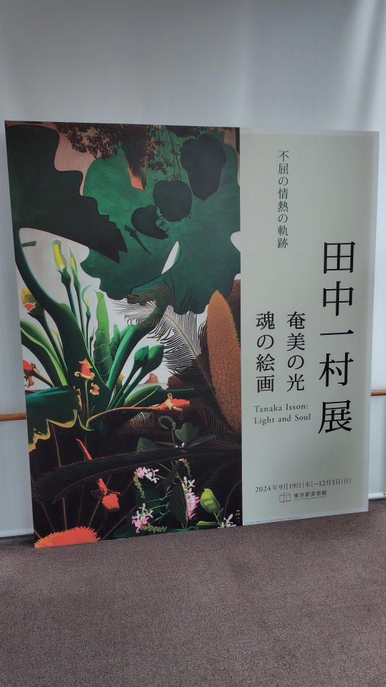

---
tags:
    - exhibition
date: 2024-10-27
---
# 東京都美術館 田中一村展
旅先で小さな色紙に絵を描いて旅土産として世話になった人に贈るとか、
生前は無名だったようで身近な人との関わりの中で描かれた作品も多かったのだろうか。

ポストカードを3枚購入。
## 忍冬に尾長
個人蔵らしく公式の写真が見つからないが、私はこの絵で尾長という鳥を知った。
## 秋色
[田中一村記念美術館](https://amamipark.com/isson/)蔵
## 秋色虎鶫
とらつぐみ。これも個人蔵。

## 写真

## リンク
<https://www.tobikan.jp/exhibition/2024_issontanaka.html>
