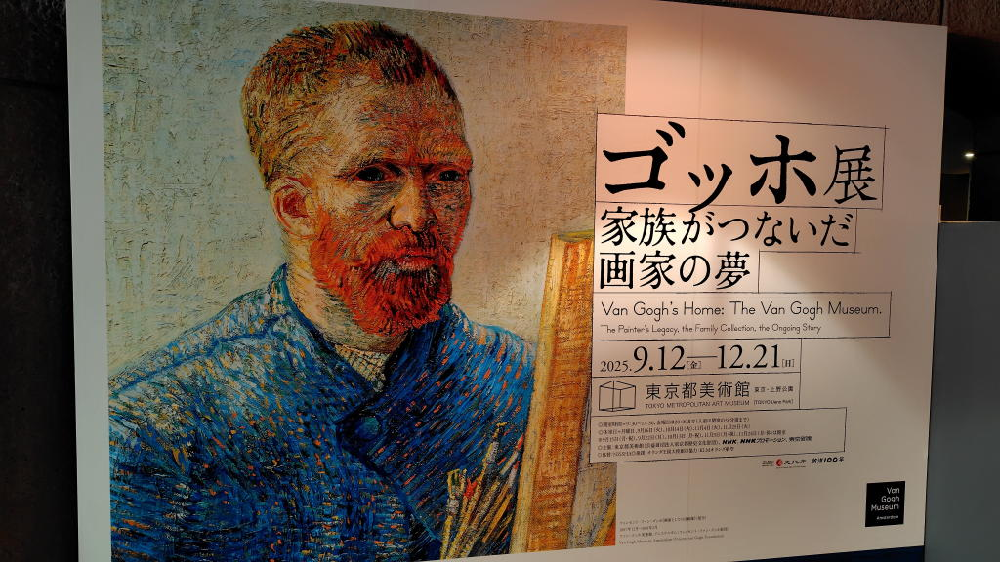

---
tags:
    - exhibition
date: 2025-10-10
---
# 東京都美術館 ゴッホ展 家族がつないだ画家の夢
ゴッホの名前は知っていたが作品や生い立ちについての解説を見るのはこれが初めてだった。
なんとなく共感できるものを感じることができたし、推しの一人になったかもしれない。

早逝、37歳で気に入っていた麦畑で拳銃自殺、晩年は精神病院に入っていたようだ。
医師からは「過去を振り返らずに仕事に打ち込め」と言われていたとのこと。
何があったのかまではわからないが、辛さのようなものを絵にぶつけてきたのだろうか。

## 気に入った作品のリスト
### モンマルトルの菜園
<https://www.stedelijk.nl/en/collection/2188-vincent-van-gogh-moestuinen-op-montmartre>
### 種まく人
<https://www.vangoghmuseum.nl/en/collection/s0029V1962>
### 畝
<https://www.vangoghmuseum.nl/en/collection/s0040V1962>
### 自画像
<https://www.vangoghmuseum.nl/en/collection/s0022V1962>
### ひまわり
<https://www.vangoghmuseum.nl/en/collection/s0031V1962>
### ヴェルサイユ街道 ロカンクール(ピサロ)
<https://www.vangoghmuseum.nl/en/collection/s0512S2006>
### 荒れ模様の空の麦畑
<https://www.vangoghmuseum.nl/en/collection/s0106V1962>

これはポスカのみで展示はされていなかった

## リンク
- <https://www.tobikan.jp/exhibition/2025_vangogh.html>
- <https://www.stedelijk.nl/en>
- <https://www.vangoghmuseum.nl/en>
