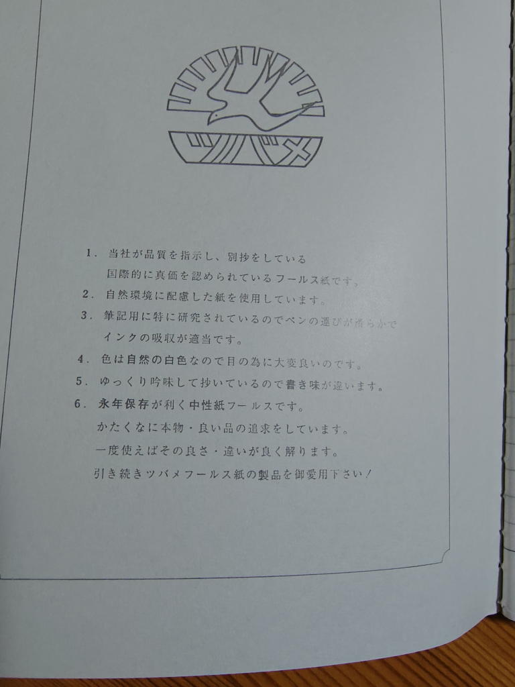
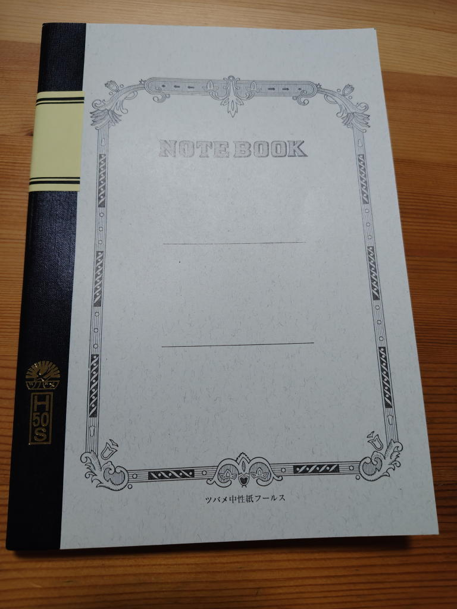

---
tags:
    - lifestyle
---
# モーニングページ用にツバメノートを買った
2026年8月25日。

手書きなんてオワコンでは?などと思っていたが、

『ずっとやりたかったことを、やりなさい』や
[『じぶんの『声』で書く技術』](./writing-without-teachers.md)を読んで課題に取り組んでいる中で
手書きをする頻度も増えてきたし、
何よりもやっぱり手書きのほうが自分の考えや想いを表に出しやすいということが分かってきた。

それで、手元にあったノートがそろそろ使い切りそうになってきたから
新しいノートを買いに文房具屋というか三省堂神保町の2階へ行った。

ノートなんてなんでもいいや...と思っていたのだが、
ツバメノートを開いたところに書いてある

> 色は自然の白色なので目の為に大変良いのです。

という何ともレトロな説明書きに一目惚れ。H50SというA5サイズ50枚のノートを買った。\396なり。

## リンク
<https://www.tsubamenote.co.jp/>

ホームページもレトロなこと。
