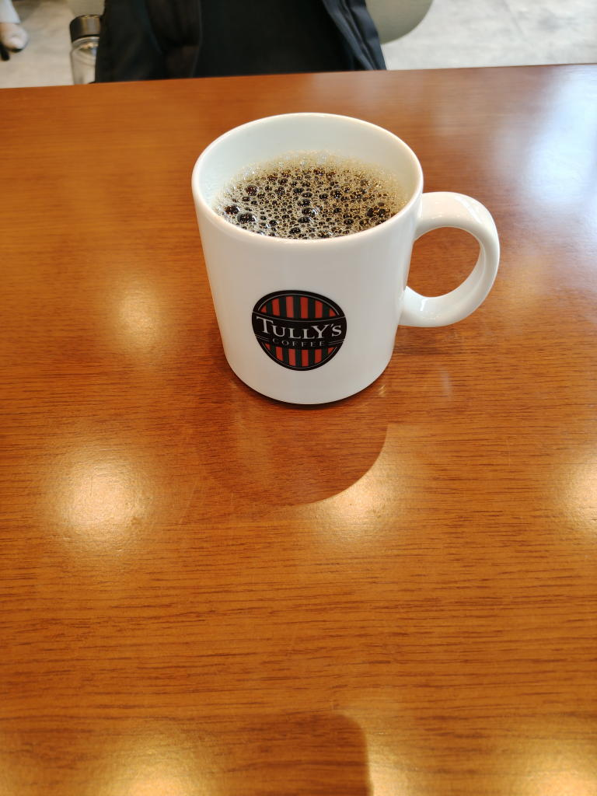

---
tags:
    - dining
---
# タリーズコーヒー
米国シアトル発祥のコーヒーショップ

## 2026-09-02 神保町三井ビルディング店
本日のコーヒー
ホット。トールで\450。

本日のというくらいだから店や日によっても違うかもしれないが
無難な味で好みかも。苦め。
トールだけどめちゃくちゃ多い。家で飲むのが少ないからか。

レシートに記載されていたQRコードを読み込んでアンケートにも答えてあげた。

コーヒー1杯で1時間粘ってしまった。

夏だからアイスというのもいいかもしれないが、ホットのほうが味は分かりやすいかもしれない。

デカイ...普段家で飲んでいる量の倍くらいは入っている。

- 店員の愛想が良くて好印象
- 値段もそこそこで量も多い
- 先に席を確保しても良さそう。やっぱりカフェ全般がこんなものなのかもしれない。
- 店内用のマグカップに入っていた。
- 飲み終わったら返却口へ持っていく。
- 飲んでいる最中にコーヒーが垂れてしまう...紙ナプキン的なものが置いてあれば良いんだけど。あったかな。
- wifi完備
