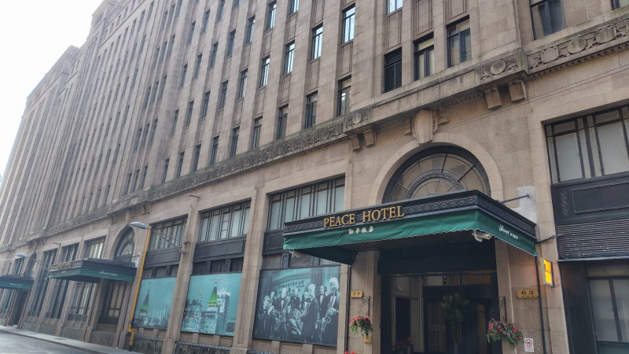
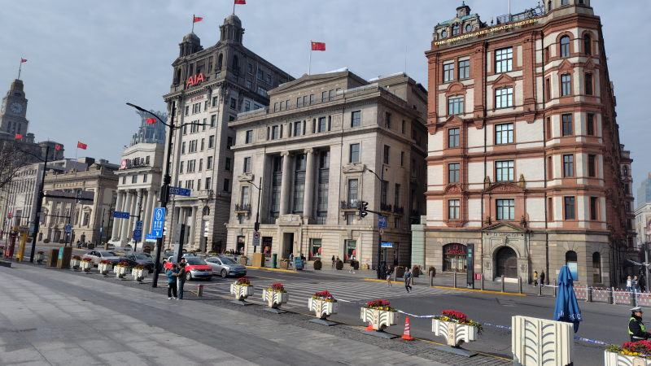
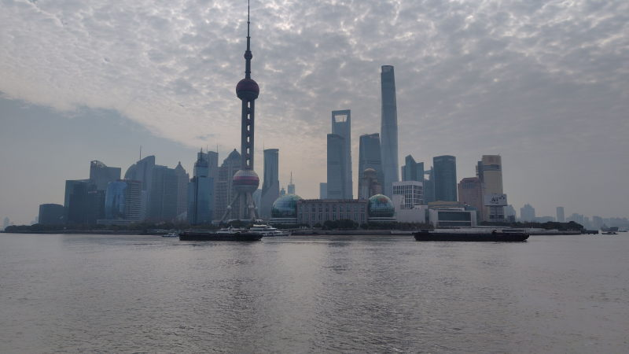
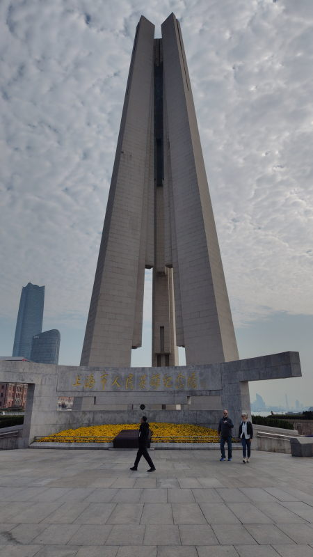
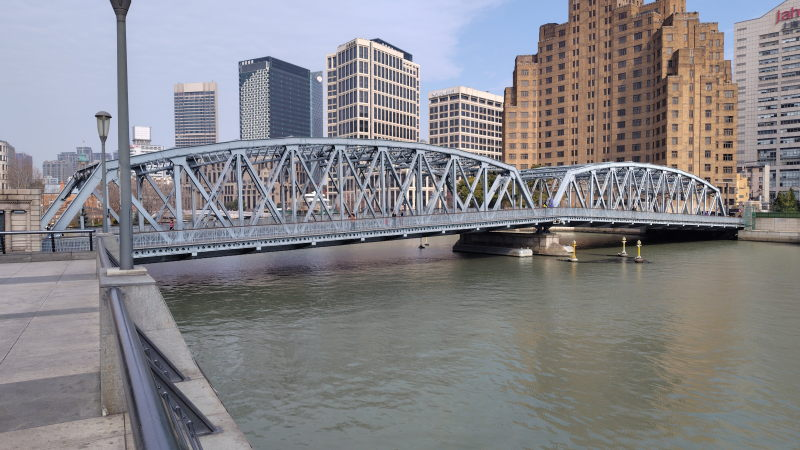
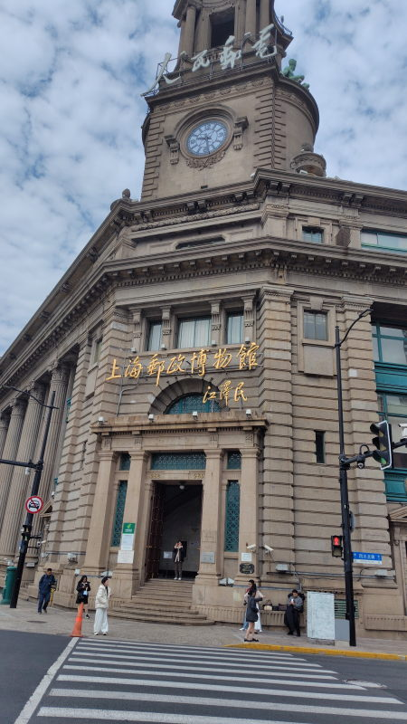

---
tags:
    - shanghai
date: 2026-03-22
---
# 外滩
Wàitān。わいたん。

## アクセス
最寄りは10号線の南京东路駅。
地上に出て東にまっすぐ、10分くらい歩く。

## メモ
アヘン戦争に破れた中国が上海を開港、その時の租界（外国人居留地）だった場所で、
黄浦江の西が西洋風の建物、東が電波塔を始めとした高層ビル群が立ち並ぶ。

上海と言われてすぐに思い浮かぶ景色はここから見ているのだろう。

展望がよく開けていて川岸から対岸一帯を見渡せるようになっている。
国際都市というべきか、外国人も多く歩いていたのが印象的だった。

北には人民英雄纪念塔があって地下は記念館になっている。
塔の下には花と献花台みたいのがある。

塔のすぐ西にある外白渡橋は1907年に掛けられた橋で
歴史のある、戦争を生き延びた橋ということで有名らしい。

## 郵政博物館

