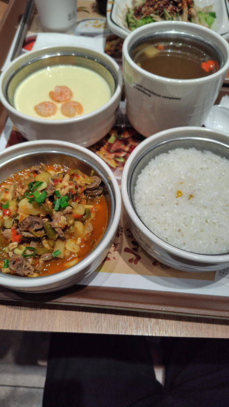
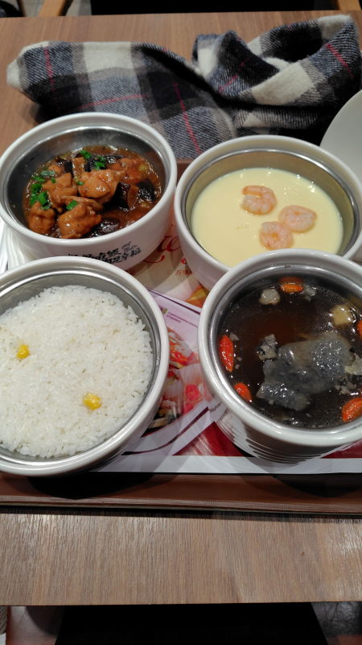
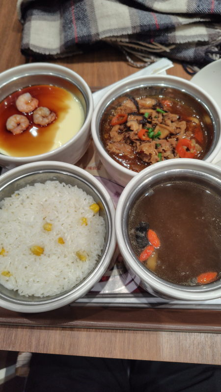
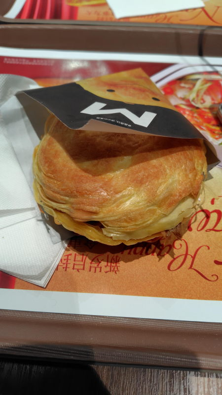
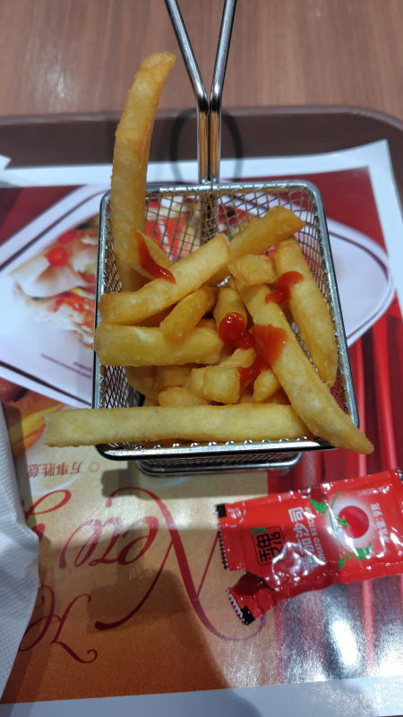

---
tags:
    - tianjin
---
# 魏家凉皮
Wèi jiā liángpí

凉皮は冷麺のことで発祥は陝西省、西安。

バーガーキングの隣りにある通称「混んでる店」。実際、ほかの店とは比較にならないくらい
混んでいていつ見ても満席に近いくらい人が入っている。

テーブルにQRコードはなく、カウンターで注文する。

WeChatのミニプログラムもある。店名で検索すると注文用のアプリを起動できるが、
门店帮忙 méndiàn bāngmáng となっていてメニューの表示はできるが注文はできなかった

注文後は番号で呼びされる。一応電光掲示板みたいのはあるのだが、1度に1つの番号しか表示されなくてあまり役に立たない。

機械音声で

请五九五号自助取餐 Qǐng wǔ jiǔ wǔ hào zìzhù qǔ cān

のように呼び出される

## 酸辣鸡杂饭套餐  Suān là jīzá fàn tàocān
鸡杂は鳥の内臓みたいな意味。

套餐はセットのことで、

- 米饭
- 乌鸡汤（Wūjī tāng）黒鶏のスープ?烏骨鶏みたいなことを出井部長がおっしゃっていた気がする、骨付きの鶏肉で出汁を取っていて底に沈殿している。
- 虾仁蒸蛋（Xiārén zhēng dàn） 海老入り茶碗蒸し。虾仁は海老、蛋は卵

がつく。

## 香菇滑鸡饭套餐 Xiānggū huá jī fàn tàocān
31元。しいたけと鶏肉のセット

## 牛肉饭套餐 Niúròu fàn tàocān
34元。

## 优质肉夹馍 Yōuzhì ròu jiā mó
15元。高級中国バーガー

## 薯条 Shǔ tiáo
9元。ポテト。

