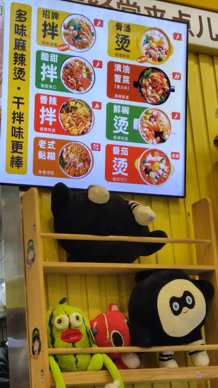
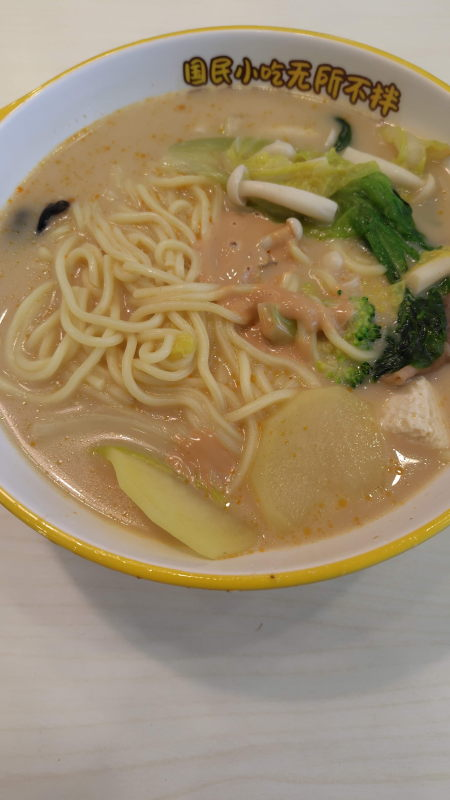
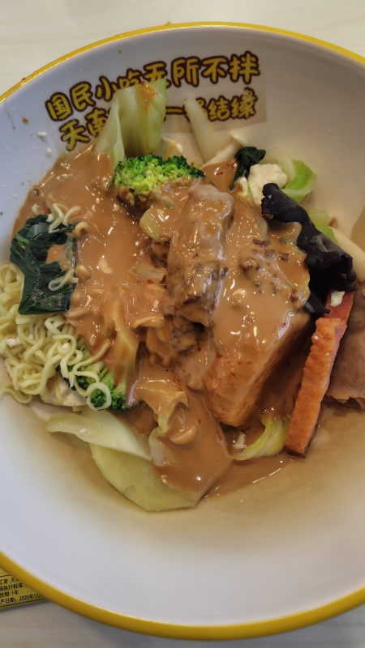
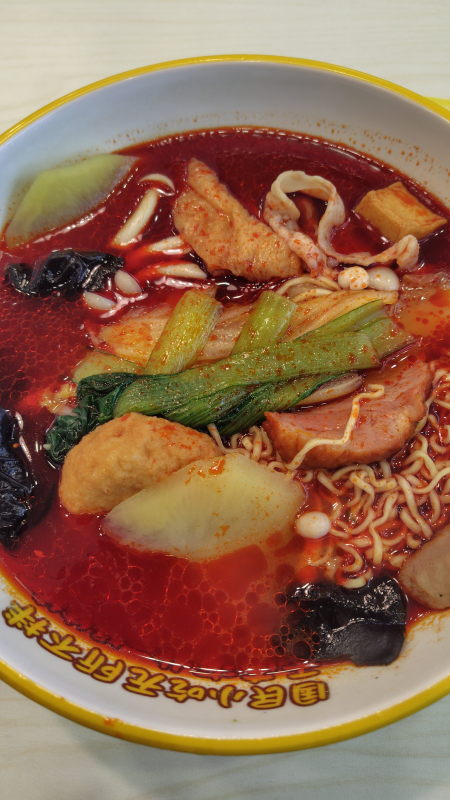
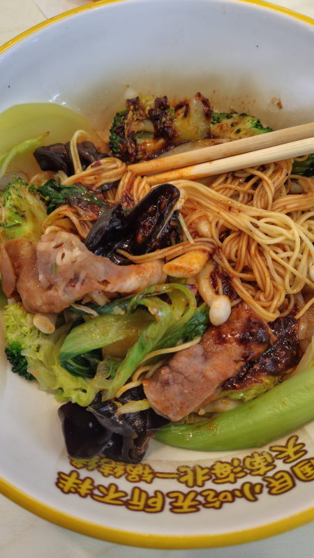

---
tags:
    - tianjin
---
# 小谷姐姐
麻辣汤の店。

店に入ったらボウルを取って好きな具材を入れていく。
量り売りになっていて重量で値段が決まる。25元/500gで、1食20-25元くらいになることが多い。

8種類のタレから1つ選んで店員に伝える必要がある。

支払いはWeChat。

## 经典麻辣烫 骨汤
豚骨か鶏ガラスープ

## 招牌麻辣拌 麻酱干拌
麻酱はゴマダレのこと

## 番茄麻辣烫
トマト味

## 酸甜拌
舌がしびれるような酸味

