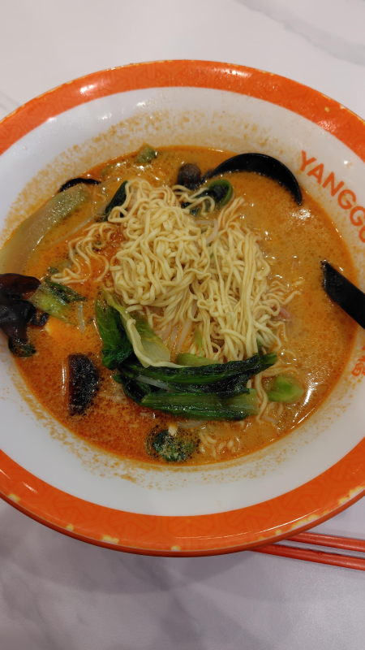
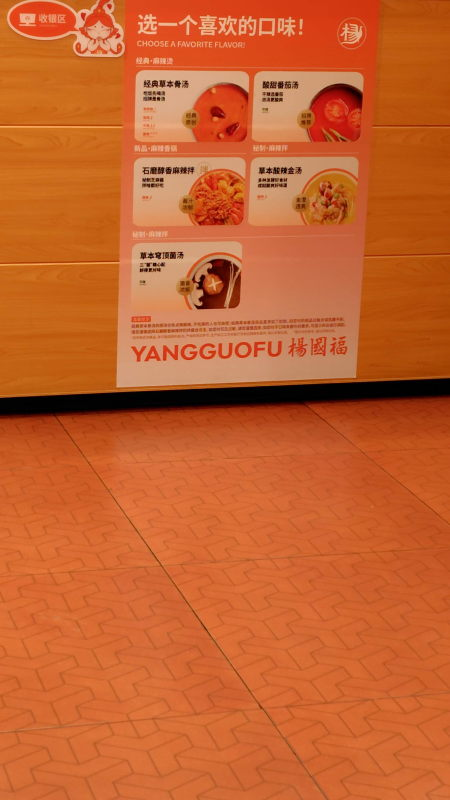

---
tags:
    - shanghai
---
# 楊国福麻辣烫
Yángguófú málà tàng

水城駅の近くにある麻辣湯の店。

入口でボウルを取って好きな具材を選ぶ。量り売り。
スープは5種類の中から選んで店員に口頭か指差し等で伝える。

## 经典草本骨汤

## スープ
- 经典草本骨汤 Jīngdiǎn cǎoběn gǔ tāng 定番ハーブ入り。辛さを選べる。
- 酸甜番茄汤 Suān tián fānqié tāng トマトスープ
- 石磨醇香麻辣拌 Shí mò chúnxiāng málà bàn スパイシーミックス?
- 草本酸辣金汤 Cǎoběn suān là jīntāng 薬膳スープ
- 草本穹顶菌汤 Cǎoběn qióngdǐng jūn tāng ハーブ入りスープ

