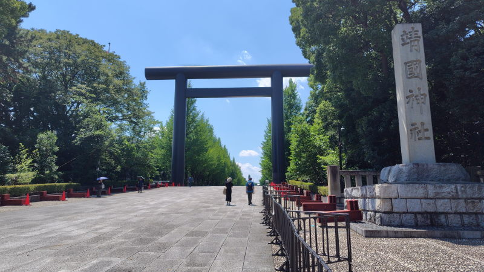

---
tags:
    - tokyo
---
# 靖国神社
はじめて行ったのは2014年1月1日。
それ以来、神社に行くとなったらとりあえずここでお参りをしている。
終戦記念日とか正月とかは行かないが、時期を外すと空いていてゆっくり参拝できるのが良い。

## 訪問記録
### 2026-07-25
[2026-07-25](./blog/posts/2026-07-25.md) 適応障害で休んでいる最中に

### 2026-08-14
[2026-08-14](./blog/posts/2026-08-14.md) 終戦記念日前日。
## リンク
<https://www.yasukuni.or.jp/>
