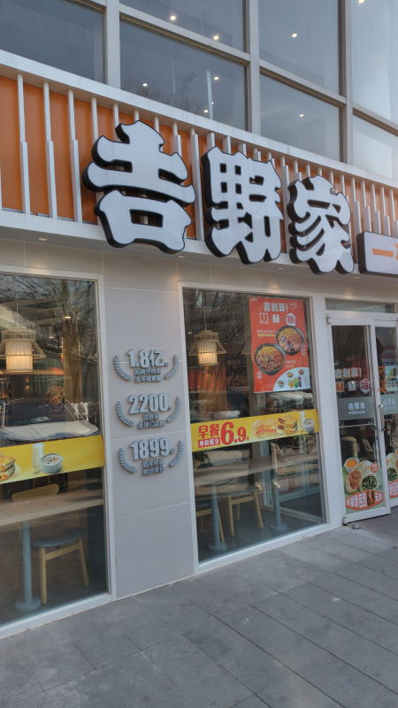
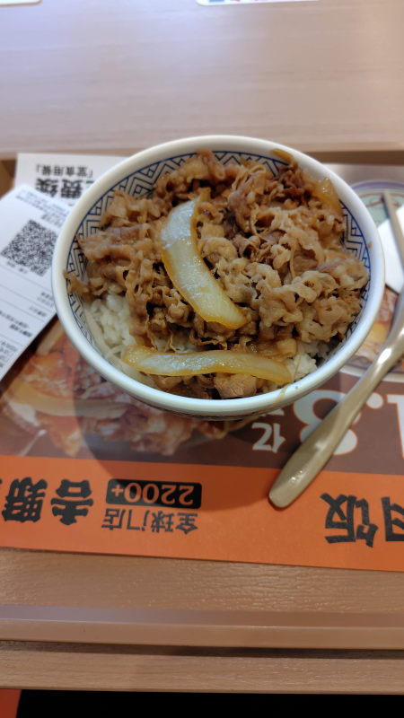

---
tags:
    - china
---
# 吉野家
カウンターで注文するか、WeChatでミニプログラムを検索して注文する。

注文するとオーダー番号が渡される。カウンターの上部にディスプレイがあって準備状況がわかる。
出来上がったら取りに行く。

食べ終わった後のトレイはそのままで良い。

## 招牌牛肉饭 中碗 Zhāopái niúròu fàn (zhōng wǎn)
22.5元

[yoshinoya]: ./static/images/20260111T122238_e41a9.jpg
