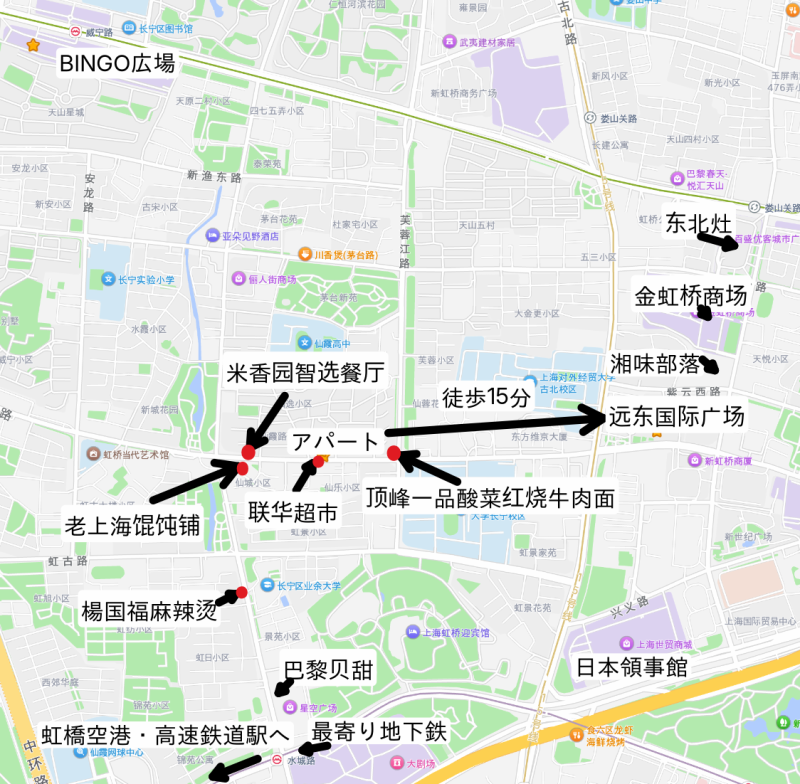

---
tags:
    - shanghai
---
# 长宁区
Zhǎngníng qū

## 食事
### 麺
- [顶峰一品酸菜红烧牛肉面](./suancaihongshaoniuroumian.md)
### 湖南
- [湘味部落](./xiangweibuluo.md)
### 広東
- [老上海馄饨铺](./laoshanghaihuntunpu.md)
### 東北地方
- [东北灶](./dongbeizao.md)
### 四川
- [楊国福麻辣烫](./yangguofumalatang.md)

### パン
- [巴黎贝甜](./balibeitian.md) 水城駅のすぐ北にある。
### その他
- [米香园智选餐厅](./mixiangyuanzhixuanchanting.md)

## 買い物・食事
- [金虹桥商场](./jinhongqiaoshangchang.md)
- [联华超市](./lianhuachaoshi.md)
- ローソン マンションのすぐ東にある。
- [缤谷广场(BINGO広場)](./binguguangchang.md)

