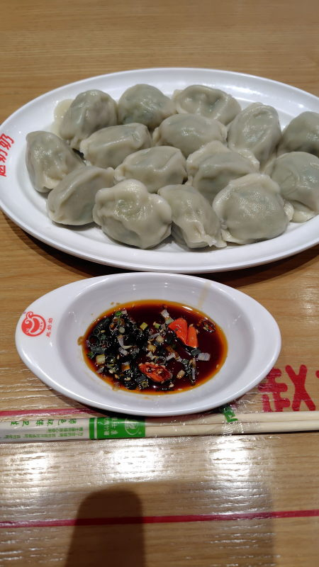
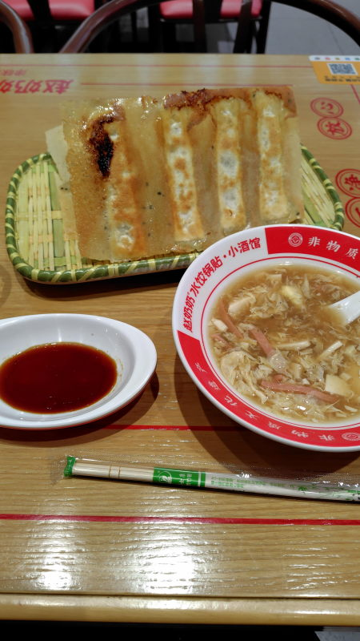
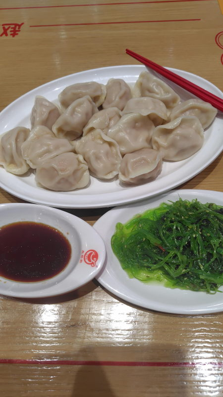
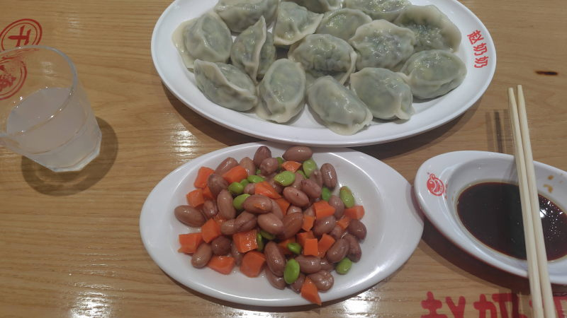
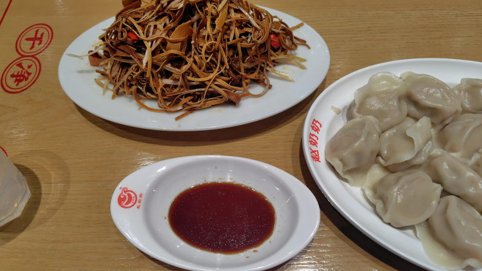
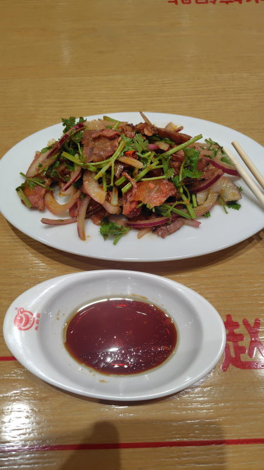
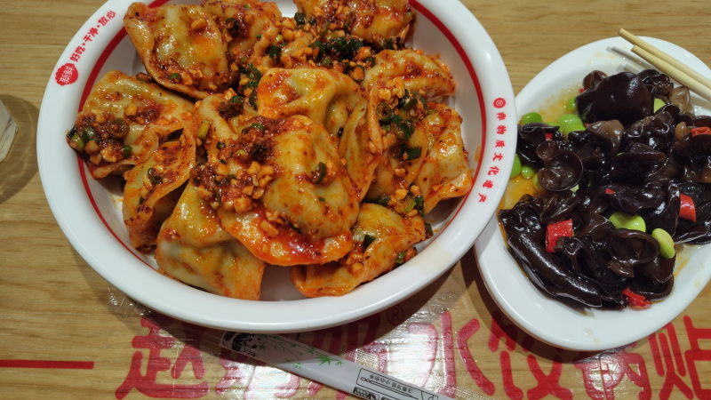
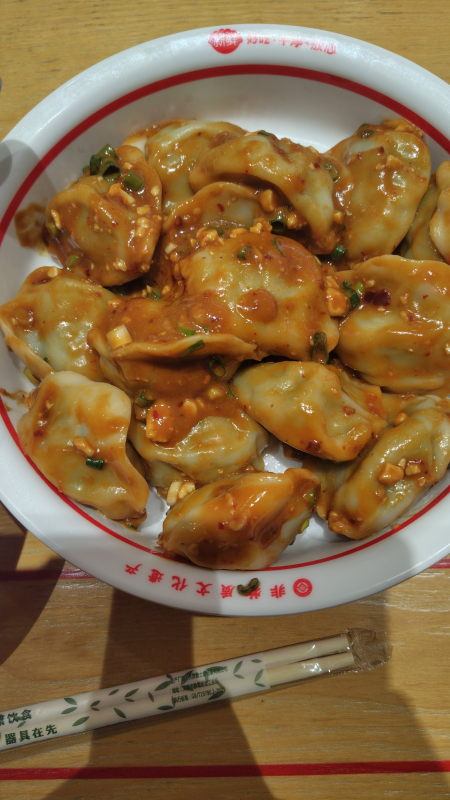
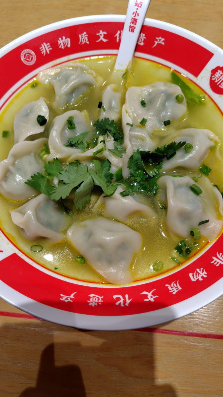

---
tags:
    - tianjin
---
# 赵奶奶水饺锅贴
Zhào nǎinai shuǐjiǎo guōtiē

店の奥にタレと水のコーナーがある。無料。

向かって左側の給湯器は本当にただのお湯が出てくる。右側の濁ったのはよく分からない。餃子の茹で汁?

QRコードで注文可能。

水餃子(水饺)と焼き餃子(锅贴)がある。15個入り

## 水餃子
- 招牌虾三鲜水饺 :: エビ 29.9元
- 韭菜鲜肉水饺 :: ニラ 21.9元
- 白菜鲜肉水饺 :: 白菜 21.9元
- 茴香鲜肉水饺 :: フェンネル(ハーブ) 21.9元
- 小白菜鸡蛋水饺 :: 玉子白菜 19.9元
- 玉米鲜肉水饺 :: とうもろこし 25.9元

## 焼き餃子
- 招牌虾三鲜锅贴 :: エビ 29.9元
- 鸡蛋西葫锅贴 :: ズッキーニと玉子 21.9元

## サイドメニュー
### 黑椒酸辣汤
サンラータン。3.9元

### 葱香秋耳
きくらげ。8.9元
### 美味海藻丝
わかめサラダ。7.9元

### 什锦花生米
豆サラダ。7.9元

### 特色豆腐丝
13.9元。豆腐線

### 拌牛腱子
牛すじの炒めもの。パクチー入り。19.9元

## 味付け
3元足すと水餃子に味付けを加えることができる

### 红油干拌
ラー油

### 麻酱拌
麻婆豆腐の餡のような感じ。

### 酸汤
酸っぱ辛い。サンラータンのようなスープ。

